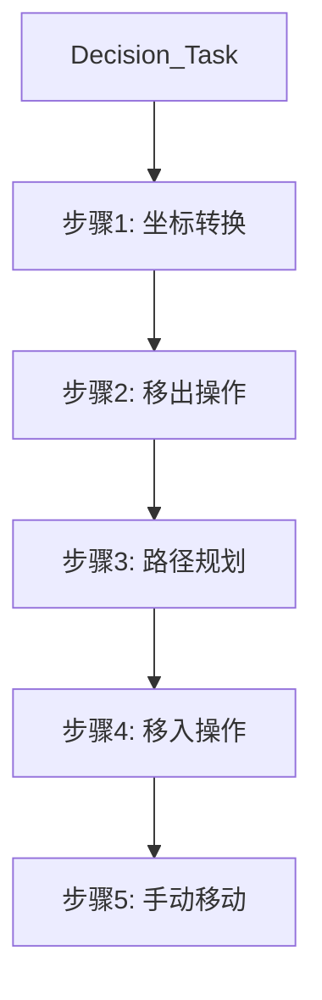
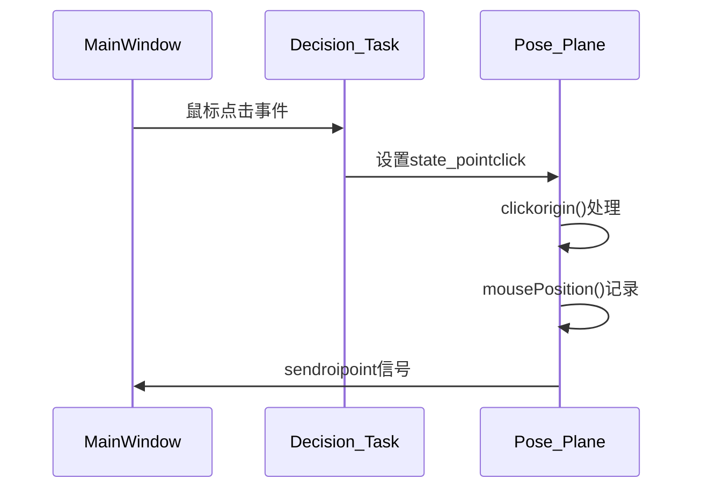
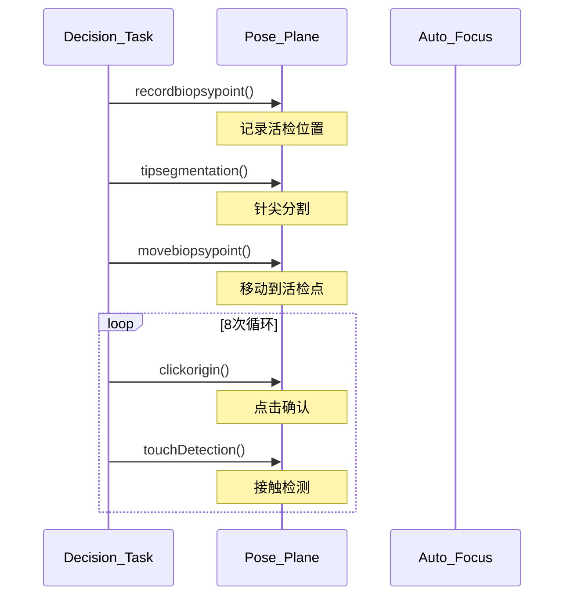
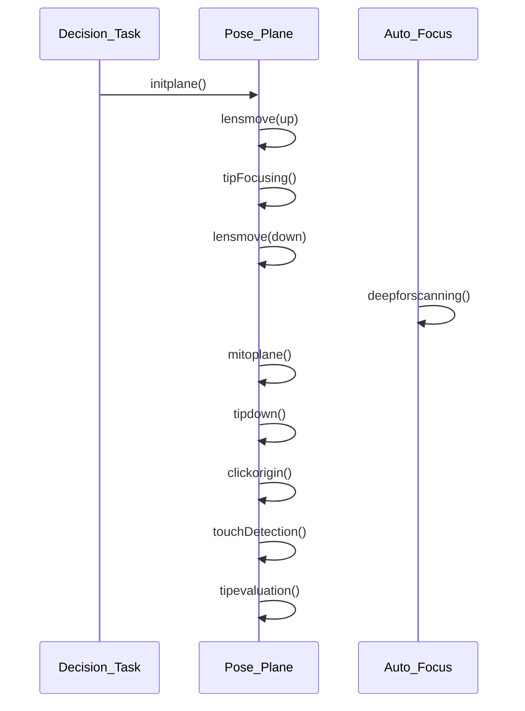
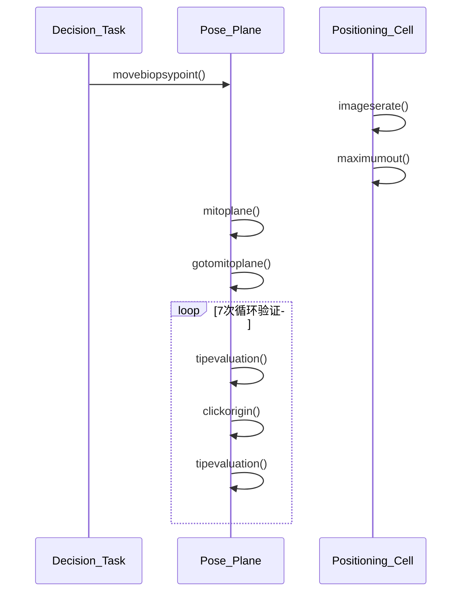

GitHub Copilot

vector<Point2i> stateHandle={{state_idle,state_coordinateTransformation},{state_idle,state_moveOut},
                                     {state_pathPlaning,state_idle},{state_idle,state_moveIn},
                                     {state_idle,state_manualmove},{state_idle,state_touchDetection},
                                     {state_idle,state_coordinateTransformation},
                                     {state_idle,state_penetration},{state_idle,state_electrochemicalMapping},{state_idle,state_idle}};//其中x是细胞的状态，y是针尖的状态


让我详细解释 `stateHandle` 状态序列中的每一步：

# 1. 全自动状态序列详解



## 步骤1: {state_idle, state_coordinateTransformation}
- Auto_Focus状态: `state_idle`(不动作)
- Pose_Plane状态: `state_coordinateTransformation`
- 调用函数: `positioning_tip.cpp::coordinateTransformation()`
- 功能: 计算图像坐标系到实际坐标系的转换矩阵
- 输出: `transformMatrix` 转换矩阵

## 步骤2: {state_idle, state_moveOut}
- Auto_Focus状态: `state_idle`(不动作)
- Pose_Plane状态: `state_moveOut`
- 调用函数: `positioning_tip.cpp::moveOut()`
- 功能: 控制针尖向外移动指定距离
- 参数: `outDistance` 移动距离

## 步骤3: {state_pathPlaning, state_idle}
- Auto_Focus状态: `state_pathPlaning`
- Pose_Plane状态: `state_idle`(不动作)
- 调用函数: `positioning_cell.cpp::pathPlaning()`
- 功能: 计算最优运动路径
- 输出: `bestPath` 路径点序列

## 步骤4: {state_idle, state_moveIn}
- Auto_Focus状态: `state_idle`(不动作)
- Pose_Plane状态: `state_moveIn`
- 调用函数: `positioning_tip.cpp::moveIn()`
- 功能: 控制针尖向内移动到指定位置
- 参数: `bestPath` 路径信息

## 步骤5: {state_idle, state_manualmove}
- Auto_Focus状态: `state_idle`(不动作)
- Pose_Plane状态: `state_manualmove`
- 调用函数: `positioning_tip.cpp::manualmove()`
- 功能: 手动微调针尖位置
- 参数: `manualDistace`, `manualSpeed`

## 步骤6: {state_idle, state_touchDetection}
- Auto_Focus状态: `state_idle`(不动作)
- Pose_Plane状态: `state_touchDetection`
- 调用函数: `positioning_tip.cpp::touchDetection()`
- 功能: 检测针尖是否接触目标
- 输出: `touchFlag` 接触状态标志

## 步骤7: {state_idle, state_coordinateTransformation}
- Auto_Focus状态: `state_idle`(不动作)
- Pose_Plane状态: `state_coordinateTransformation`  
- 调用函数: `positioning_tip.cpp::coordinateTransformation()`
- 功能: 再次校准坐标系
- 输出: 更新后的 `transformMatrix`

## 步骤8: {state_idle, state_penetration}
- Auto_Focus状态: `state_idle`(不动作)
- Pose_Plane状态: `state_penetration`
- 调用函数: `positioning_tip.cpp::penetration()`
- 功能: 执行穿刺操作
- 参数: `penetrationTime`, `penetrationDepth`

## 步骤9: {state_idle, state_electrochemicalMapping}
- Auto_Focus状态: `state_idle`(不动作)
- Pose_Plane状态: `state_electrochemicalMapping`
- 调用函数: `positioning_tip.cpp::electrochemicalmapping()`
- 功能: 电化学扫描测量
- 输出: 电化学数据

## 步骤10: {state_idle, state_idle}
- Auto_Focus状态: `state_idle`
- Pose_Plane状态: `state_idle`
- 功能: 任务完成，等待新任务

每个状态的执行通过 `decision_task_run()` 函数控制：
```cpp
void Decision_Task::decision_task_run() {
    // 设置当前状态
    A_Focus->Auto_Focus_Slect = stateHandle[actionStep].x;
    pose_plane->planeSelection = stateHandle[actionStep].y;
    
    // 状态机执行对应函数
    // Auto_Focus::decision()
    // Pose_Plane::decision()
}
---------------------------
#
让我详细解释 `stateHandleclick` 状态序列：

# stateHandleclick 状态序列分析

这是一个重复7次的点击确认序列，用于手动标记关键位置点。

## 1. 状态向量结构
```cpp
vector<Point2i> stateHandleclick = {
    {state_idle, state_pointclick},      // 第1次点击确认
    {state_idle, state_pointclick},      // 第2次点击确认
    {state_idle, state_pointclick},      // 第3次点击确认
    {state_idle, state_pointclick},      // 第4次点击确认
    {state_idle, state_pointclick},      // 第5次点击确认
    {state_idle, state_pointclick},      // 第6次点击确认
    {state_idle, state_pointclick}       // 第7次点击确认
};
```

## 2. 每步执行过程

对于每一个 `{state_idle, state_pointclick}`:

1. 自动对焦模块状态：
```cpp
// positioning_cell.cpp
void Auto_Focus::decision() {
    // state_idle: 保持空闲
    // 不执行任何操作
}
```

2. 平面定位模块状态：
```cpp
// positioning_tip.cpp
void Pose_Plane::decision() {
    case state_pointclick:
        // 1. 调用clickorigin()函数
        clickorigin();  
        // 2. 记录鼠标点击位置
        mousePosition(x, y);
        // 3. 发送位置信号
        emit sendroipoint(x, y, openFlag);
}
```

## 3. 相关函数详解

### 3.1 clickorigin()函数
```cpp
// positioning_tip.cpp
int8_t Pose_Plane::clickorigin() {
    // 1. 获取当前图像
    Mat currentImg = Image_Control->GetImage();
    
    // 2. 处理ROI区域
    Rect roi(x-roiXLen/2, y-roiYLen/2, roiXLen, roiYLen);
    Mat roiImg = currentImg(roi);
    
    // 3. 保存点击位置信息
    originpoint = Point2d(x, y);
    
    return 1;
}
```

### 3.2 mousePosition()函数
```cpp
// positioning_tip.cpp
void Pose_Plane::mousePosition(float x, float y) {
    // 1. 记录鼠标位置
    mouseRatio.x = x;
    mouseRatio.y = y;
    
    // 2. 更新界面显示
    showImgUI(currentImg);
}
```

## 4. 信号传递流程



## 5. 执行流程

1. 用户在界面点击位置
2. `Decision_Task` 设置状态为 `state_pointclick`
3. `Pose_Plane` 执行点击处理:
   - 记录点击位置
   - 提取ROI区域
   - 更新显示
4. 发送位置信号
5. 等待下一次点击

这个序列主要用于:
1. 手动标记关键点
2. ROI区域选择
3. 位置确认
4. 交互式操作
---------------------------------------------------------------------------------------------
//钳取模式离线模式和模式调正
        vector<Point2i> stateHandleSemi={
            {state_idle,state_biopsypointrecord},
            {state_idle,state_tipseg},
            {state_idle,state_movebiopsypoint},
            {state_idle,state_pointclick},
            {state_idle,state_touchDetection},
            {state_idle,state_pointclick},
            {state_idle,state_touchDetection},
        {state_idle,state_pointclick},
        {state_idle,state_touchDetection},
        {state_idle,state_pointclick},
        {state_idle,state_touchDetection},
        {state_idle,state_pointclick},
        {state_idle,state_touchDetection},
        {state_idle,state_pointclick},
        {state_idle,state_touchDetection},
        {state_idle,state_pointclick},
        {state_idle,state_touchDetection},
        {state_idle,state_pointclick},
        {state_idle,state_touchDetection}};//其中x是细胞的状态，y是针尖的状态
        详细说明，这个向量，每一步都在干什么，调用哪个cpp文件的哪个函数？
——
# stateHandleSemi 钳取模式状态序列详解

## 1. 初始化阶段
```cpp
{state_idle, state_biopsypointrecord}
// 调用: positioning_tip.cpp::recordbiopsypoint()
// 功能: 记录活检点位置坐标
// 输出: params_struct biopsyParams 包含活检位置信息
```

## 2. 针尖分割阶段
```cpp
{state_idle, state_tipseg}
// 调用: positioning_tip.cpp::tipsegmentation()
// 功能: 使用YOLO模型进行针尖分割
// 输出: contour针尖轮廓信息
```

## 3. 移动到活检位置
```cpp
{state_idle, state_movebiopsypoint}
// 调用: positioning_tip.cpp::movebiopsypoint()
// 功能: 控制针尖移动到记录的活检点
// 参数: biopsyParams中的位置信息
```

## 4-19. 多次点击和接触检测循环(8次循环)
每次循环包含:
```cpp
// 第一步: 点击确认
{state_idle, state_pointclick}
// 调用: positioning_tip.cpp::clickorigin()
// 功能: 记录点击位置
// 输出: originpoint位置信息

// 第二步: 接触检测
{state_idle, state_touchDetection}
// 调用: positioning_tip.cpp::touchDetection()
// 功能: 检测针尖是否接触目标
// 输出: touchFlag接触状态
```

## 完整执行流程



## 关键代码示例

### 1. 活检点记录
```cpp
// positioning_tip.cpp
int8_t Pose_Plane::recordbiopsypoint() {
    // 记录当前位置
    biopsyParams.x = currentPosition.x;
    biopsyParams.y = currentPosition.y;
    biopsyParams.z = currentPosition.z;
    return 1;
}
```

### 2. 针尖分割
```cpp
// positioning_tip.cpp
void Pose_Plane::tipsegmentation() {
    // 使用YOLO模型分割
    modelneedle->detect(currentImg, contour);
    // 处理分割结果
    processContour();
}
```

### 3. 移动控制
```cpp
// positioning_tip.cpp
int8_t Pose_Plane::movebiopsypoint() {
    // 计算移动距离
    Point3f distance = calculateDistance(biopsyParams);
    // 执行移动
    moveToPosition(distance);
    return 1;
}
```

### 4. 循环检测
```cpp
// positioning_tip.cpp
int8_t Pose_Plane::touchDetection() {
    // 获取当前电流值
    double current = getCurrentValue();
    // 判断是否接触
    if(current > touchThreshold) {
        touchFlag = 1;
        return 1;
    }
    return 0;
}
```

这个序列主要用于实现半自动活检操作，通过多次点击和接触检测来确保操作的准确性和安全性。
-----------------------------------------------------------------------------

//简化版全模式出数据（省去三维坐标转换和移动）
        vector<Point2i> stateHandleAllsimple={{state_idle,state_initplane},{state_idle,state_lensup},{state_idle,state_tipFocusing},{state_idle,state_lensdown},{state_3Dscanning,state_idle},{state_idle,state_mitoplane},{state_idle,state_tipdownward},{state_idle,state_pointclick},{state_idle,state_touchDetection},{state_idle,state_verification}};
           详细说明，这个向量，每一步都在干什么，实现了哪个功能，分别调用哪个cpp文件的哪个函数来实现的？
# stateHandleAllsimple 简化全模式状态序列详解

## 1. 初始平面设置
```cpp
{state_idle, state_initplane}
// 调用: positioning_tip.cpp::initplane()
// 功能: 设置初始观察平面
// 输出: focusinitplane 初始平面位置
```

## 2. 镜头上移
```cpp
{state_idle, state_lensup}
// 调用: positioning_tip.cpp::lensmove()
// 功能: 控制物镜向上移动固定距离
// 参数: direction = 1 向上移动
```

## 3. 针尖对焦
```cpp
{state_idle, state_tipFocusing}
// 调用: positioning_tip.cpp::tipFocusing()
// 功能: 对针尖进行自动对焦
// 输出: tipFocusPosition 针尖对焦位置
```

## 4. 镜头下移
```cpp
{state_idle, state_lensdown}
// 调用: positioning_tip.cpp::lensmove()
// 功能: 控制物镜向下移动到特定位置
// 参数: direction = -1 向下移动
```

## 5. 3D扫描
```cpp
{state_3Dscanning, state_idle}
// 调用: positioning_cell.cpp::deepforscanning()
// 功能: 执行Z轴序列扫描
// 输出: 扫描图像序列
```

## 6. 线粒体平面设置
```cpp
{state_idle, state_mitoplane}
// 调用: positioning_tip.cpp::mitoplane()
// 功能: 设置线粒体观察平面
// 输出: focusmitoplane 线粒体平面位置
```

## 7. 针尖下移
```cpp
{state_idle, state_tipdownward}
// 调用: positioning_tip.cpp::tipdown()
// 功能: 控制针尖向下运动到指定位置
// 输出: tipControlPosition 针尖控制位置
```

## 8. 点击确认
```cpp
{state_idle, state_pointclick}
// 调用: positioning_tip.cpp::clickorigin()
// 功能: 记录用户点击位置
// 输出: originpoint 点击坐标
```

## 9. 接触检测
```cpp
{state_idle, state_touchDetection}
// 调用: positioning_tip.cpp::touchDetection()
// 功能: 检测针尖是否接触目标
// 输出: touchFlag 接触状态
```

## 10. 验证确认
```cpp
{state_idle, state_verification}
// 调用: positioning_tip.cpp::tipevaluation()
// 功能: 验证接触状态
// 输出: tipFlag 验证结果
```

## 执行流程图



这是一个精简版的全自动工作流程，主要用于:
1. 自动对焦定位
2. Z轴序列扫描
3. 线粒体观察
4. 接触检测验证
-------------------------------------------------------------------------------------------------------
//简化版全模式出数据（省去三维坐标转换和移动）
        vector<Point2i> stateHandleAllsimple={{state_idle,state_initplane},{state_idle,state_lensup},{state_idle,state_tipFocusing},{state_idle,state_lensdown},{state_3Dscanning,state_idle},{state_idle,state_mitoplane},{state_idle,state_tipdownward},{state_idle,state_pointclick},{state_idle,state_touchDetection},{state_idle,state_verification}};
           详细说明，这个向量，每一步都在干什么，实现了哪个功能，分别调用哪个cpp文件的哪个函数来实现的？

# stateHandleAllsimple 简化全模式状态序列详解

## 1. 初始平面设置
```cpp
{state_idle, state_initplane}
// 调用: positioning_tip.cpp::initplane()
// 功能: 设置初始观察平面
// 输出: focusinitplane 初始平面位置
```

## 2. 镜头上移
```cpp
{state_idle, state_lensup}
// 调用: positioning_tip.cpp::lensmove()
// 功能: 控制物镜向上移动固定距离
// 参数: direction = 1 向上移动
```

## 3. 针尖对焦
```cpp
{state_idle, state_tipFocusing}
// 调用: positioning_tip.cpp::tipFocusing()
// 功能: 对针尖进行自动对焦
// 输出: tipFocusPosition 针尖对焦位置
```

## 4. 镜头下移
```cpp
{state_idle, state_lensdown}
// 调用: positioning_tip.cpp::lensmove()
// 功能: 控制物镜向下移动到特定位置
// 参数: direction = -1 向下移动
```

## 5. 3D扫描
```cpp
{state_3Dscanning, state_idle}
// 调用: positioning_cell.cpp::deepforscanning()
// 功能: 执行Z轴序列扫描
// 输出: 扫描图像序列
```

## 6. 线粒体平面设置
```cpp
{state_idle, state_mitoplane}
// 调用: positioning_tip.cpp::mitoplane()
// 功能: 设置线粒体观察平面
// 输出: focusmitoplane 线粒体平面位置
```

## 7. 针尖下移
```cpp
{state_idle, state_tipdownward}
// 调用: positioning_tip.cpp::tipdown()
// 功能: 控制针尖向下运动到指定位置
// 输出: tipControlPosition 针尖控制位置
```

## 8. 点击确认
```cpp
{state_idle, state_pointclick}
// 调用: positioning_tip.cpp::clickorigin()
// 功能: 记录用户点击位置
// 输出: originpoint 点击坐标
```

## 9. 接触检测
```cpp
{state_idle, state_touchDetection}
// 调用: positioning_tip.cpp::touchDetection()
// 功能: 检测针尖是否接触目标
// 输出: touchFlag 接触状态
```

## 10. 验证确认
```cpp
{state_idle, state_verification}
// 调用: positioning_tip.cpp::tipevaluation()
// 功能: 验证接触状态
// 输出: tipFlag 验证结果
```

## 执行流程图


这是一个精简版的全自动工作流程，主要用于:
1. 自动对焦定位
2. Z轴序列扫描
3. 线粒体观察
4. 接触检测验证
------------------------------------------------------------------------
vector<Point2i> stateHandleMultibiopsy ={{state_idle,state_movebiopsypoint},{state_imagesemly,state_idle},
                                                 {state_maximumout,state_idle},{state_idle,state_mitoplane},
{state_idle,state_gotomitoplane},{state_idle,state_verification},{state_idle,state_pointclick},{state_idle,state_verification},{state_idle,state_pointclick},{state_idle,state_verification},{state_idle,state_pointclick},{state_idle,state_verification},{state_idle,state_pointclick},{state_idle,state_verification},{state_idle,state_pointclick},{state_idle,state_verification},{state_idle,state_pointclick},{state_idle,state_verification},{state_idle,state_pointclick},{state_idle,state_verification}};


# stateHandleMultibiopsy 多次活检状态序列详解

## 1. 初始化移动
```cpp
{state_idle, state_movebiopsypoint}
// 调用: positioning_tip.cpp::movebiopsypoint()
// 功能: 移动到记录的活检位置
// 参数: biopsyParams 活检点信息
```

## 2. 图像拼接
```cpp
{state_imagesemly, state_idle}
// 调用: positioning_cell.cpp::imageserate()
// 功能: 处理扫描图像序列拼接
// 输出: 拼接后的图像序列
```

## 3. 最大输出
```cpp
{state_maximumout, state_idle}
// 调用: positioning_cell.cpp::maximumout()
// 功能: 计算最大强度投影
// 输出: maxProjection 最大投影图像
```

## 4. 线粒体平面设置
```cpp
{state_idle, state_mitoplane}
// 调用: positioning_tip.cpp::mitoplane()
// 功能: 设置线粒体观察平面
// 输出: focusmitoplane 平面位置
```

## 5. 移动到线粒体平面
```cpp
{state_idle, state_gotomitoplane}
// 调用: positioning_tip.cpp::gotomitoplane()
// 功能: 移动物镜到线粒体观察平面
// 参数: focusmitoplane 目标平面
```

## 6-20. 多次验证和点击循环(7次循环)
每次循环包含:
```cpp
// 步骤1: 点击验证
{state_idle, state_verification}
// 调用: positioning_tip.cpp::tipevaluation()
// 功能: 验证当前状态
// 输出: tipFlag 验证结果

// 步骤2: 点击确认
{state_idle, state_pointclick}
// 调用: positioning_tip.cpp::clickorigin()
// 功能: 记录用户点击位置
// 输出: originpoint 点击位置
```

## 工作流程图



## 关键代码实现

### 1. 移动功能
```cpp
// positioning_tip.cpp
int8_t Pose_Plane::movebiopsypoint() {
    // 计算目标位置
    Point3f targetPosition = calculateTargetPosition(biopsyParams);
    // 执行移动
    return moveToPosition(targetPosition);
}
```

### 2. 图像处理
```cpp
// positioning_cell.cpp
void Positioning_Cell::imageserate() {
    // 拼接图像序列
    Mat result;
    for(auto img : imageSequence) {
        processAndStitch(img, result);
    }
}
```

### 3. 验证功能
```cpp
// positioning_tip.cpp
int8_t Pose_Plane::tipevaluation() {
    // 获取当前图像
    Mat currentImage = Image_Control->GetImage();
    // 分析针尖位置
    return analyzeTipPosition(currentImage);
}
```

这个状态序列主要用于实现多次活检操作中的:
1. 图像采集和处理
2. 位置精确定位
3. 多点验证确认
4. 操作安全保证

