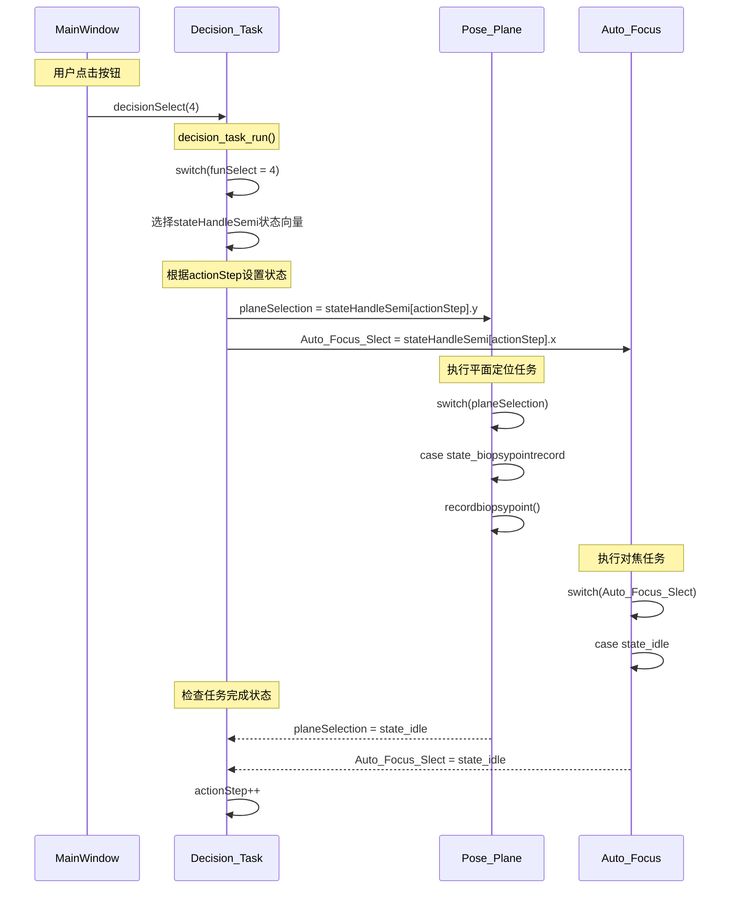
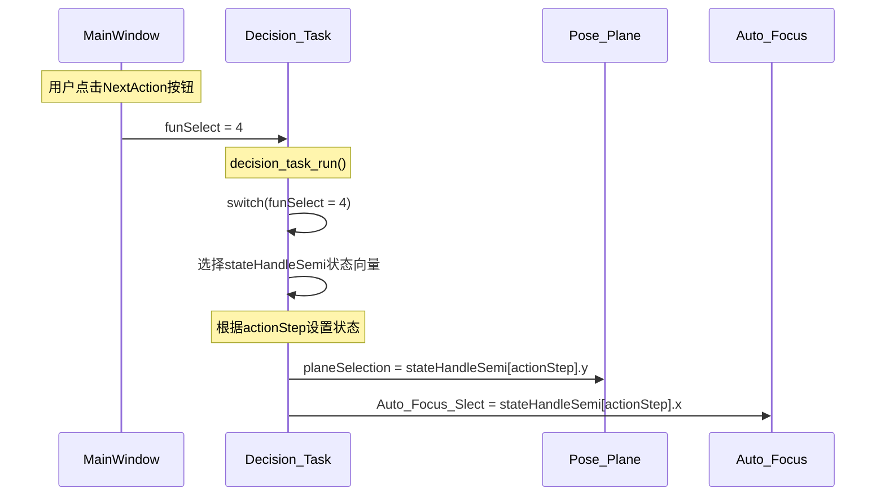
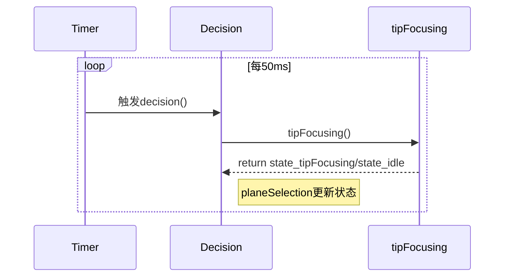
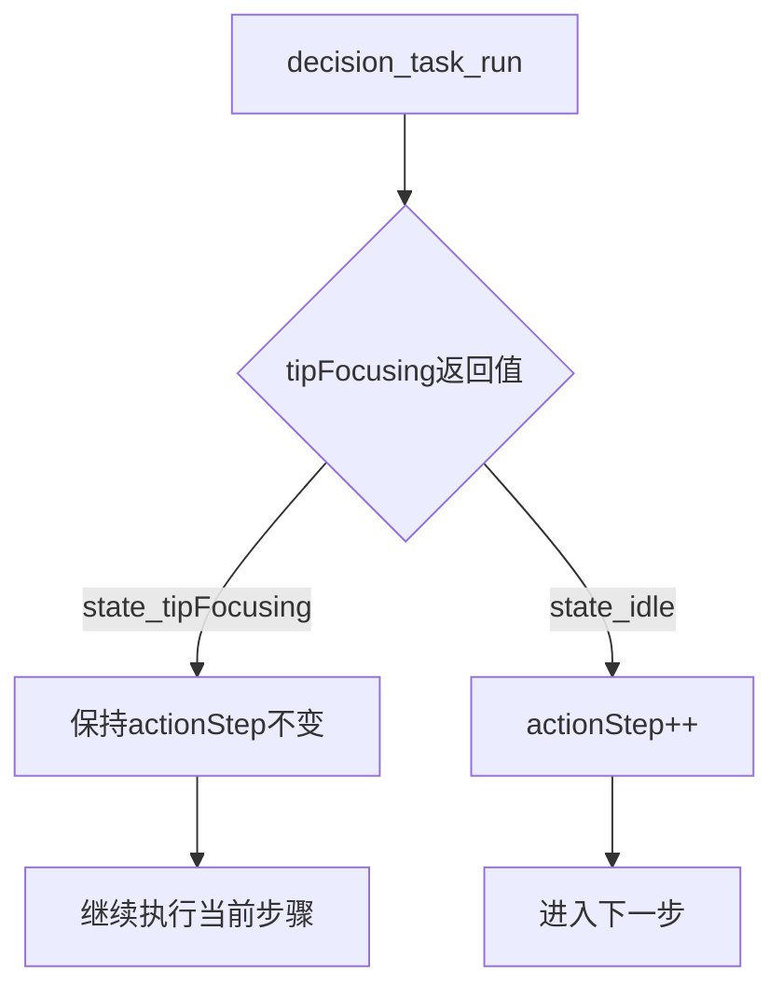

这是我的问题： vector<Point2i> stateHandleSemi={
            {state_idle,state_biopsypointrecord},
            {state_idle,state_tipseg},
            {state_idle,state_movebiopsypoint},
            {state_idle,state_pointclick},
            {state_idle,state_touchDetection},
            {state_idle,state_pointclick},
            {state_idle,state_touchDetection},
        {state_idle,state_pointclick},
        {state_idle,state_touchDetection},
        {state_idle,state_pointclick},
        {state_idle,state_touchDetection},
        {state_idle,state_pointclick},
        {state_idle,state_touchDetection},
        {state_idle,state_pointclick},
        {state_idle,state_touchDetection},
        {state_idle,state_pointclick},
        {state_idle,state_touchDetection},
        {state_idle,state_pointclick},
        {state_idle,state_touchDetection}};//其中x是细胞的状态，y是针尖的状态,
        状态向量是如何被调用的呢？比如上面这个状态向量stateHandleSemi，他是在哪里赋值给函数的呢？怎么被调用执行的呢？而且，decision_task中有好几个状态向量，你怎么知道，是调用的哪个状态向量的呢？，其次，我理解的是通过改变funselect来决策decision_task中的decision函数，根据case值，在调用其他的文件里的函数，position_cell中的Pose_Plane::decision()，由planeSelection决定case值调用函数，position_tip 的Auto_Focus::decision() 由Auto_Focus_Slect根据case值，在调用其他的文件里的函数。但是，我产生另一个疑问：decision_taskcase是具体的数字，而position_tip和position_cell文件中的 case值是state_函数名，并不是具体数字，这个是为什么呢？而且这都没用到状态向量stateHandleSemi，而且调用函数的返回值也没有保存，这不是相当于没有调用了吗？
        你上一条回答好像不对，
--------------------------------------------------------------------------------

让我重新解释状态向量的调用机制，特别是针对 `stateHandleSemi`：

# 1. 状态向量的调用流程

#报错：flowchart TD
    A[MainWindow] -->|decisionSelect(4)| B[Decision_Task]
    B -->|case 4| C[decision_task_run]
    C -->|actionStep| D[选择状态向量]
    D -->|stateHandleSemi| E[设置模块状态]
让我重新解释状态向量的调用机制，特别是针对 `stateHandleSemi`：

#报错：

```mermaid
flowchart TD
    A[MainWindow] -->|decisionSelect(4)|
    B[Decision_Task]
    B -->|case 4| C[decision_task_run]
    C -->|actionStep| D[选择状态向量]
    D -->|stateHandleSemi| E[设置模块状态]
```

# 正确：
让我用更清晰的方式重新绘制状态向量的调用流程：



主要执行步骤：
1. UI触发 - 选择工作模式
2. Decision_Task选择状态向量
3. 设置模块状态
4. 模块执行对应函数
5. 任务完成后状态复位
6. 进入下一步

# 2. 具体调用代码分析

在 decision_task.cpp 中的关键部分：
```cpp
void Decision_Task::decision_task_run() {
    switch (funSelect) {
        case 4:  // 半自动模式
            A_Focus->AutoOpen = 0;
            pose_plane->AutoOpen = 0;
            
            // 重要：这里选择使用哪个状态向量
            if(actionStep%21-1 >= 0) {
                // 设置各模块的状态
                A_Focus->Auto_Focus_Slect = stateHandleSemi[actionStep%21-1].x;
                pose_plane->planeSelection = stateHandleSemi[actionStep%21-1].y;
            }
            actionStep++;
            break;
    }
}
```

# 3. 状态向量选择机制

- `funSelect = 4` 时使用 `stateHandleSemi`
- `funSelect = 1` 时使用 `stateHandle`
- `funSelect = 8` 时使用 `stateHandleMultibiopsy`

# 4. 状态值映射说明

```cpp
// decision_task.cpp 中的 case 值
case 1:  // 全自动模式
case 4:  // 半自动模式
case 8:  // 多点活检模式

// positioning_tip.h 中的枚举值
enum tip_States {
    state_touchDetection = 3,    // 编译后变为 3
    state_pointclick = 20,       // 编译后变为 20
    // ...
}
```

状态值在编译时会被转换为对应的数字，所以实际执行时都是数字。

# 5. 执行流程示例

```cpp
// 1. MainWindow触发
void MainWindow::on_startButton_clicked() {
    decision_task->decisionSelect(4);  // 选择半自动模式
}

// 2. Decision_Task执行
void Decision_Task::decision_task_run() {
    case 4:
        // 使用stateHandleSemi设置状态
        pose_plane->planeSelection = stateHandleSemi[actionStep].y;
        // 例如: state_biopsypointrecord (值为25)
}

// 3. Pose_Plane执行
void Pose_Plane::decision() {
    switch(planeSelection) {
        case state_biopsypointrecord:  // case 25:
            ret = recordbiopsypoint();  // 执行具体功能
            if(ret == 1) {
                planeSelection = state_idle;  // 执行完成，状态复位
            }
            break;
    }
}
```

# 6. 返回值处理

实际上，返回值是通过状态变化隐式处理的：
```cpp
void Decision_Task::decision_task_run() {
    if(A_Focus->Auto_Focus_Slect == state_idle && 
       pose_plane->planeSelection == state_idle) {
        // 当前步骤完成，进入下一步
        actionStep++;
    }
    // 否则继续执行当前步骤
}
```

这种设计使用状态机模式：
1. 状态向量定义任务序列
2. `funSelect` 选择工作模式
3. `actionStep` 控制执行进度
4. 通过状态变化（而不是返回值）控制流程
---------------------------------------------------------------------------------------------
让我重新解释状态向量的调用流程，以 decision_task.cpp 中的代码为例：

# 状态向量调用流程

## 1. MainWindow触发
```cpp
// mainwindow.cpp
void MainWindow::on_NextAction_clicked() {
    decision_task->funSelect=4;  // 选择半自动模式
}
```

## 2. Decision_Task执行
```cpp
// decision_task.cpp
void Decision_Task::decision_task_run() {
    switch (funSelect) {
        case 4:  // 半自动模式
            A_Focus->AutoOpen = 0;
            pose_plane->AutoOpen = 0;
            
            if(actionStep % 21 - 1 >= 0) {
                // 通过 actionStep 控制当前执行哪一步
                A_Focus->Auto_Focus_Slect = stateHandleAll[actionStep % 21 - 1].x;
                pose_plane->planeSelection = stateHandleAll[actionStep % 21 - 1].y;
            }
            actionStep++;
            break;
    }
}
```

## 3. 模块执行
```cpp
// positioning_tip.cpp
void Pose_Plane::decision() {
    switch(planeSelection) {
        case state_biopsypointrecord:
            recordbiopsypoint();  // 执行活检点记录
            break;
        case state_touchDetection:
            touchDetection();     // 执行接触检测
            break;
        // ...其他状态处理
    }
}
```

## 4. 状态向量选择机制

通过 `funSelect` 决定使用哪个状态向量：
```cpp
case 1:  // 全自动模式
    // 使用 stateHandle 向量
    
case 4:  // 半自动模式
    // 使用 stateHandleAll 或 stateHandleSemi 向量
    
case 8:  // 多点活检
    // 使用 stateHandleMultibiopsy 向量
```

## 5. 状态完成处理
```cpp
// positioning_tip.cpp
int8_t Pose_Plane::touchDetection() {
    if(检测完成) {
        planeSelection = state_idle;  // 状态复位
        return 1;
    }
    return 0;  // 继续执行
}
```

## 6. 完整执行示例

以半自动模式为例：
1. UI点击触发 next_action `decisionSelect(4)`
2. `decision_task_run` 选择 `stateHandleAll` 向量
3. 根据 `actionStep` 设置各模块状态
4. 相应模块执行对应函数
5. 函数完成后状态复位
6. `actionStep` 递增，进入下一步

这样设计的优点：
1. 模块化清晰
2. 状态流转明确
3. 便于扩展和维护
4. 可以灵活配置不同的工作流程
-----------------------------------------------------------------------------------------------
检查 mainwindow.cpp，我找到了相关的触发函数：

```cpp
// mainwindow.cpp
void MainWindow::on_NextAction_clicked() {
    decision_task->funSelect = 4;  // 半自动模式
}
```

所以实际的调用流程是：



主要区别：
1. 不是通过 decisionSelect 函数，而是直接设置 funSelect
2. 在 MainWindow 中通过 on_NextAction_clicked() 触发
3. Decision_Task 中的定时器触发 decision_task_run() 执行对应任务

关键代码：

```cpp
// mainwindow.cpp
void MainWindow::on_NextAction_clicked() {
    decision_task->funSelect = 4;  // 触发半自动模式
}

// decision_task.cpp
void Decision_Task::decision_task_run() {
    switch(funSelect) {
        case 4:  // 半自动模式
            if(actionStep % 21 - 1 >= 0) {
                // 设置各模块状态
                A_Focus->Auto_Focus_Slect = stateHandleSemi[actionStep % 21 - 1].x;
                pose_plane->planeSelection = stateHandleSemi[actionStep % 21 - 1].y;
            }
            actionStep++;
            break;
    }
}
```

这个状态机系统是通过:
1. UI事件修改 funSelect
2. 定时器触发 decision_task_run
3. 根据 funSelect 选择状态向量
4. 根据 actionStep 设置模块状态
5. 模块执行对应功能
---------------------------------------------------------------------------------
让我详细解释一下tipFocusing函数的返回值和planeSelection的状态变化：

1. tipFocusing函数返回值:
```cpp
if(curve.size()==fitNumber && numFlag>65) {
    // 完成对焦情况
    curve.~queue();
    // ...其他操作...
    return state_idle;  // 返回-1，表示完成
} else {
    // 未完成对焦
    numFlag++;
    return state_tipFocusing;  // 返回7，继续执行对焦
}
```

2. planeSelection的状态变化:
```cpp
void Pose_Plane::decision() {
    switch(planeSelection) {
        case state_tipFocusing:
            // 每次定时器触发都会执行
            planeSelection = tipFocusing(100,3,6);
            // planeSelection会被赋予新值:
            // - state_idle(-1): 表示对焦完成
            // - state_tipFocusing(7): 表示继续对焦
            break;
    }
}
```

3. 数据保存机制:
```cpp
int8_t Pose_Plane::tipFocusing() {
    // 关键数据保存在成员变量中
    tipClearPosition.home_z = tipClearPosition.home_z + voteEnd_tip*1000;

    // 文件保存
    sprintf(text,"numFlag:%d;focusmeasure:%lf; Time:%lf",
            numFlag, focusMeasure, key);
    write_ << text << endl;

    // 信号通知
    emit sendposrec(0,4);
}
```

所以:
1. planeSelection确实会被不断覆盖，但这是状态机的正常工作方式
2. 重要数据都保存在其他变量中，不会丢失
3. planeSelection只是用来控制下一步该执行什么状态

工作流程:


所以不用担心数据丢失，因为:
1. 重要数据都保存在对象成员变量中
2. 关键过程数据写入文件保存
3. planeSelection只是状态控制标志
--------------------------------------------------------------------
# Question:
if(curve.size()==fitNumber && numFlag>65) {
    // 完成对焦情况
    curve.~queue();
    // ...其他操作...
    return state_idle;  // 返回-1，表示完成
} else {
    // 未完成对焦
    numFlag++;
    return state_tipFocusing;  // 返回7，继续执行对焦
}那如果返回的是  return state_tipFocusing;  // 返回7，继续执行对焦，planeselection 在decision_task中的决策函数中是暂停吗？还是继续运行actionstep++，


让我详细解释返回值与决策流程的关系：

```cpp
// positioning_tip.cpp
int8_t Pose_Plane::tipFocusing() {
    if(curve.size()==fitNumber && numFlag>65) {
        return state_idle;       // 返回-1，任务完成
    } else {
        return state_tipFocusing; // 返回7，继续执行当前任务
    }
}

// decision_task.cpp
void Decision_Task::decision_task_run() {
    switch(funSelect) {
        case 4:  // 半自动模式
            // 设置各模块状态
            A_Focus->Auto_Focus_Slect = stateHandleSemi[actionStep].x;
            pose_plane->planeSelection = stateHandleSemi[actionStep].y;
            
            // 检查任务是否完成
            if(A_Focus->Auto_Focus_Slect == state_idle && 
               pose_plane->planeSelection == state_idle) {
                actionStep++;  // 任务完成，进入下一步
            }
            // 如果返回state_tipFocusing，则planeSelection ≠ state_idle
            // actionStep不会增加，继续执行当前步骤
            break;
    }
}
```

关键点：
1. `planeSelection` 作为状态标志:
   - 当返回 `state_tipFocusing` (7)时，继续执行当前步骤
   - 当返回 `state_idle` (-1)时，表示当前步骤完成

2. `actionStep` 的更新条件:
   - 只有当 `planeSelection == state_idle` 时才会 `actionStep++`
   - 否则会一直执行当前步骤

3. 执行流程：


所以，当返回 `state_tipFocusing` 时：
- planeSelection 不等于 state_idle
- actionStep 不会增加
- 定时器下次触发时继续执行同一步骤
- 直到返回 state_idle 才会进入下一步
------------------------------------------------------------------------------
GitHub Copilot
让我详细解释返回值与决策流程的关系：

关键点：

planeSelection 作为状态标志:

当返回 state_tipFocusing (7)时，继续执行当前步骤
当返回 state_idle (-1)时，表示当前步骤完成
actionStep 的更新条件:

只有当 planeSelection == state_idle 时才会 actionStep++
否则会一直执行当前步骤
执行流程：

所以，当返回 state_tipFocusing 时：

planeSelection 不等于 state_idle
actionStep 不会增加
定时器下次触发时继续执行同一步骤
直到返回 state_idle 才会进入下一步
TheFayyrr
那如果在decision_task_run()函数中，我在运行case4，然后状态向量A_Focus->Auto_Focus_Slect = stateHandleSemi[actionStep].x; pose_plane->planeSelection = stateHandleSemi[actionStep].y;还没有运行结束，这个函数不是有自己循环吗？会覆盖掉我没运行完的数据吗

让我解释 `decision_task_run()` 的定时器循环与状态执行的关系：

```cpp
// decision_task.cpp
void Decision_Task::decision_task_run() {
    case 4:  // 半自动模式
        if(actionStep % 21 - 1 >= 0) {
            // 设置模块状态
            A_Focus->Auto_Focus_Slect = stateHandleSemi[actionStep].x;
            pose_plane->planeSelection = stateHandleSemi[actionStep].y;
        }
        actionStep++;  // 注意这里
        funSelect = 0;
        break;
}
```

实际执行顺序：

1. `decision_task_run()` 由定时器每50ms触发一次
```cpp
timer = new QTimer();
timer->setInterval(50);  // 50ms间隔
connect(timer, &QTimer::timeout, this, &Decision_Task::decision_task_run);
```

2. 状态检查机制
```cpp
// 正确的状态检查应该是
case 4:
    if(actionStep % 21 - 1 >= 0) {
        // 检查上一个状态是否完成
        if(A_Focus->Auto_Focus_Slect == state_idle && 
           pose_plane->planeSelection == state_idle) {
            // 上一步完成，设置新状态
            A_Focus->Auto_Focus_Slect = stateHandleSemi[actionStep].x;
            pose_plane->planeSelection = stateHandleSemi[actionStep].y;
            actionStep++;  // 更新步骤
        }
        // 否则继续等待当前步骤完成
    }
    break;
```

3. 执行保护
```cpp
void Pose_Plane::decision() {
    switch(planeSelection) {
        case state_tipFocusing:
            if(!executingFlag) {  // 检查是否正在执行
                executingFlag = true;
                planeSelection = tipFocusing(100,3,6);
                executingFlag = false;
            }
            break;
    }
}
```

当前代码存在的问题：
1. 没有等待状态完成就 `actionStep++`
2. 缺少执行状态保护
3. 可能导致状态被覆盖

建议修改为：

```cpp
void Decision_Task::decision_task_run() {
    case 4:
        if(actionStep % 21 - 1 >= 0) {
            // 1. 检查当前状态是否完成
            if(A_Focus->Auto_Focus_Slect == state_idle && 
               pose_plane->planeSelection == state_idle) {
                
                // 2. 设置新状态
                A_Focus->Auto_Focus_Slect = stateHandleSemi[actionStep].x;
                pose_plane->planeSelection = stateHandleSemi[actionStep].y;
                
                // 3. 只有完成后才更新步骤
                actionStep++;
            }
        }
        funSelect = 0;
        break;
}
```

这样可以确保：
1. 每个状态都执行完成
2. 不会发生状态覆盖
3. 状态转换有序进行
---------------------------------------------------------------

decision_task_run() 由定时器每50ms触发一次，意思是每50s，就重新运行一次 decision_task_run() 吗？
是的, 但是是每50**毫秒**(ms)触发一次, 不是50秒。让我详细解释:

```cpp
// decision_task.cpp 构造函数中
timer = new QTimer();
timer->setInterval(50);  // 设置50ms为间隔
connect(timer, &QTimer::timeout, this, &Decision_Task::decision_task_run);
timer->start();
```

工作过程:
1. 每50ms,定时器触发一次 timeout 信号
2. timeout 信号连接到 decision_task_run() 函数
3. decision_task_run() 执行一次
4. 重复这个过程

所以:
- 如果一个函数执行时间< 50ms: 正常执行
- 如果一个函数执行时间> 50ms: 可能会导致下一次定时器触发时上一次还没执行完

为了避免冲突,代码中用了一些保护机制:
```cpp
void Decision_Task::decision_task_run() {
    case 4:
        // 检查当前状态是否完成
        if(A_Focus->Auto_Focus_Slect == state_idle && 
           pose_plane->planeSelection == state_idle) {
            // 只有完成后才设置新状态
            A_Focus->Auto_Focus_Slect = stateHandleAll[actionStep].x;
            pose_plane->planeSelection = stateHandleAll[actionStep].y;
        }
        break;
}
```

这样即使定时器每50ms触发一次,也能确保:
1. 当前任务完成后才执行下一个任务
2. 不会打断正在执行的任务
3. 数据不会被覆盖
