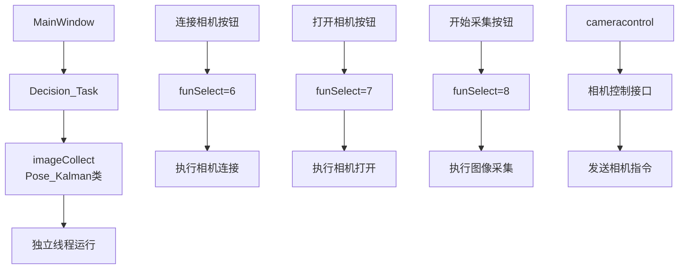
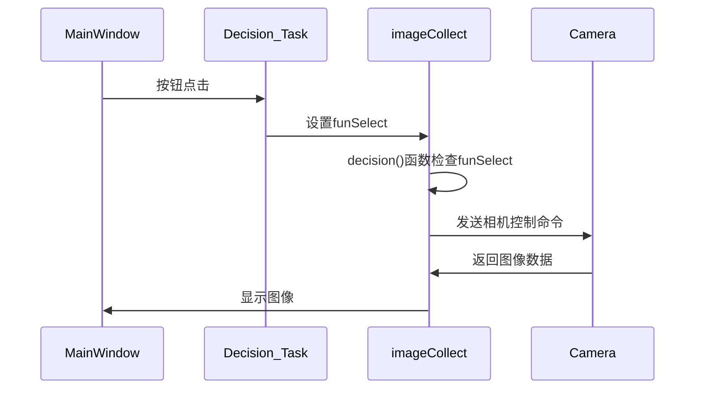
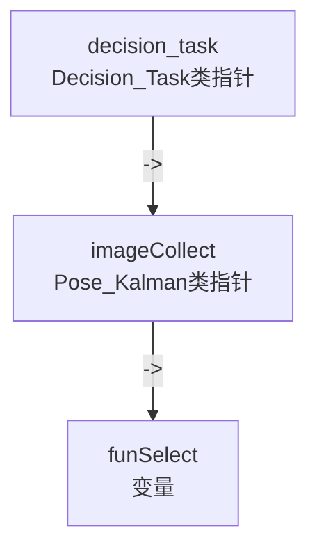

Pose_Kalman 类的对象，这个类也有一个decision函数
```cpp
void Pose_Kalman::decision()
{
    switch (funSelect) {
    case 100:
        timerKalman=new QTimer();
        timerKalman->setInterval(50);
        connect(timerKalman,&QTimer::timeout,this,&Pose_Kalman::decision);
        timerKalman->start();
        funSelect=-1;
        cout<<"waiting for imageCollection "<<endl;
        break;
    case 1:
        verticalMove();
        break;
    case 2:
//        server500();//离开聚焦平面
        funSelect=3;
        break;
    case 3:
        verticalMove();
//        videoRecord(); //开始采集图像
        break;
    case 4:
        uiShow();
//         funSelect=4;//稳定图像传输至UI
        break;
    case 5:
        whiteAndExposure();
         funSelect=4;
        break;
    case 6:
        cameracontrol->SearchDevices();
        emit devices_list(cameracontrol->m_lstDevices);
        funSelect=-1;
        break;
    case 7:
        cameracontrol->OpenDevice(cameraindex);
        cameracontrol->dialoginit();
        emit featurelist(cameracontrol->m_lstfeatures);
        funSelect=-1;
        break;
    case 8:
       nikoncamerashow();
//       Sleep(25);
       //emit fpssend(cameracontrol->m_lstfps);
        break;
    case 9:

        break;
    case 10:

        break;
    case 11:

        break;
    case 12:

        break;
    case 13:

        break;

    default:
        break;
    }
}
```

让我通过代码分析下这些关系：

1. imageCollect 的定义和初始化：
在 decision_task.cpp 中可以看到：
```cpp
imageCollect = new Pose_Kalman(m_control,nikoncamera,paramsfeed); //驱动采集图像
QThread* imageCollectThread = new QThread;
imageCollect->moveToThread(imageCollectThread);
connect(imageCollectThread, &QThread::finished, imageCollectThread, &QThread::deleteLater);
connect(imageCollectThread, &QThread::started, imageCollect, &Pose_Kalman::decision);
imageCollectThread->start();
```

这说明:
1. imageCollect 是一个 Pose_Kalman 类的对象，这个类也有一个decision函数
2. 运行在独立线程中
3. 主要负责图像采集功能 

2. funSelect 的工作原理：
```cpp
// 在 Pose_Kalman 类中通过 decision() 函数根据 funSelect 值执行不同功能
funSelect = 6  // 连接相机
funSelect = 7  // 打开相机
funSelect = 8  // 开始图像采集 
```

3. 具体函数解析：
```cpp
// 连接相机
void MainWindow::on_connect_clicked() {
    decision_task->imageCollect->funSelect = 6; // 设置状态为连接相机
}

// 打开相机
void MainWindow::on_Open_clicked() {
    int index = ui->Devicesname->currentIndex(); // 获取选择的相机索引
    decision_task->imageCollect->cameraindex = index; // 设置相机索引
    decision_task->imageCollect->funSelect = 7; // 设置状态为打开相机
}

// 开始采集
void MainWindow::on_capture_clicked() {
    // 发送开始传输命令给相机
    decision_task->imageCollect->cameracontrol->Command(CAM_CMD_START_FRAMETRANSFER);
    decision_task->imageCollect->funSelect = 8; // 设置状态为开始采集
}
```

整个工作流程：



数据流向：


主要组件：

1. imageCollect:
- Pose_Kalman类的实例
- 负责图像采集控制
- 在独立线程中运行

2. funSelect:
- 状态控制变量
- 控制执行不同的相机操作

3. cameracontrol:
- 相机控制接口
- 用于发送具体的相机指令

4. CAM_CMD_START_FRAMETRANSFER:
- 相机指令常量
- 表示开始图像传输的命令

这种设计实现了:
1. UI操作与相机控制的分离
2. 图像采集的异步处理
3. 状态机式的功能控制
4. 线程安全的数据传输


Pose_Kalman 类的对象，这个类也有一个decision函数

让我解释这种带箭头 `->` 的语法：

在 C++ 中，`->` 是指针访问运算符，用于通过指针访问对象的成员。

让我们拆解 `decision_task->imageCollect->funSelect = 8;` 这句话：

1. `decision_task` 是一个 Decision_Task 类的指针
2. `->imageCollect` 表示访问 decision_task 指向的对象中的 imageCollect 成员（这是一个 Pose_Kalman 类的指针）
3. `->funSelect` 表示访问 imageCollect 指向的对象中的 funSelect 成员（这是一个变量）

用更直观的方式表示这种结构：



代码中的实际关系：
```cpp
class Decision_Task {
    Pose_Kalman* imageCollect;  // imageCollect 是 Decision_Task 类的成员
    // ...
};

class Pose_Kalman {
    int funSelect;  // funSelect 是 Pose_Kalman 类的成员
    // ...
};
```

所以 `decision_task->imageCollect->funSelect = 8;` 可以理解为：
1. 先找到 decision_task 指针指向的 Decision_Task 对象
2. 然后找到这个对象中的 imageCollect 成员（它是个指针）
3. 再找到 imageCollect 指针指向的对象中的 funSelect 成员
4. 最后将 funSelect 赋值为 8

这种写法等价于：
```cpp
// 假设有如下变量
Decision_Task* decision_task;
Pose_Kalman* imageCollect = decision_task->imageCollect;
int& funSelect = imageCollect->funSelect;
funSelect = 8;
```

这是 C++ 中常见的指针访问方式，用于访问多层对象结构中的成员。`->` 运算符专门用于通过指针访问对象的成员，而 `.` 运算符用于直接通过对象访问成员。

在这个特定的例子中：
- `decision_task->imageCollect->funSelect = 8;` 是在设置图像采集对象的状态
- 通过修改 funSelect 的值来控制图像采集的行为
- 值 8 表示"开始采集"这个状态
