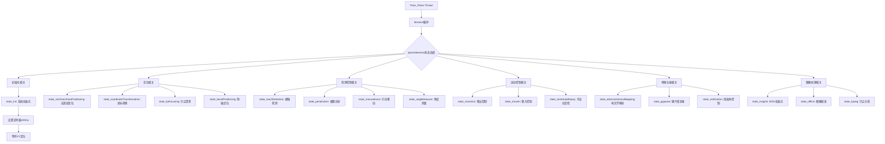
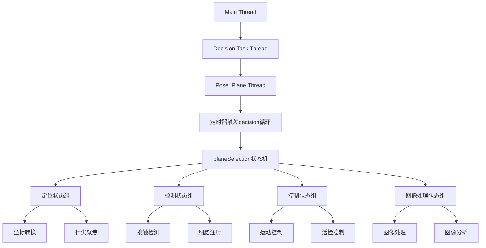
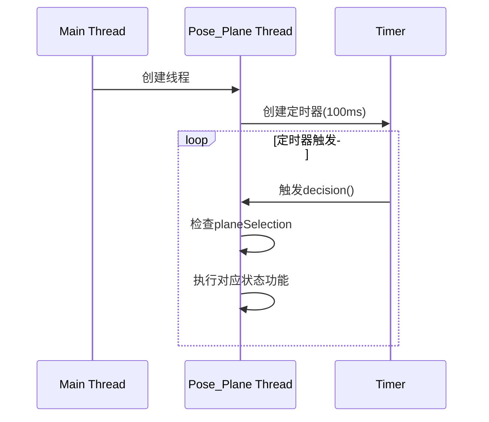
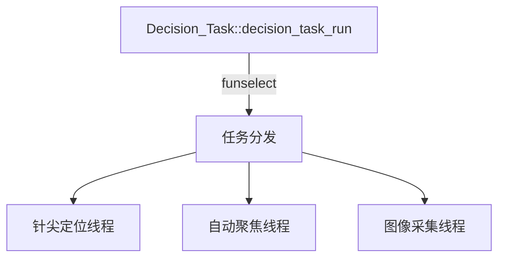
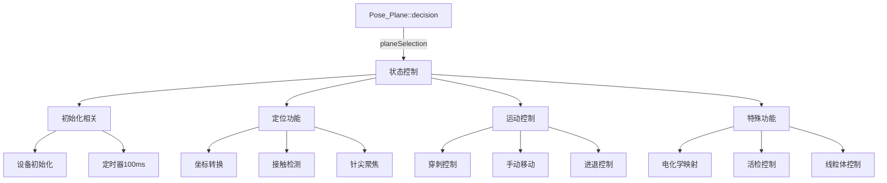
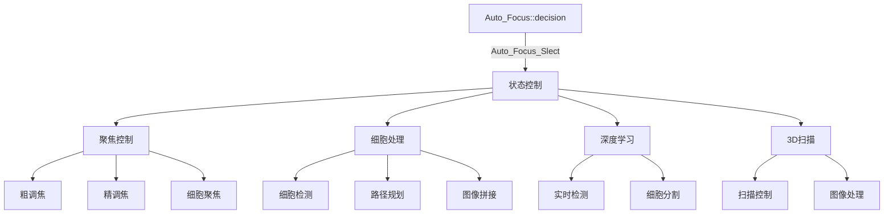
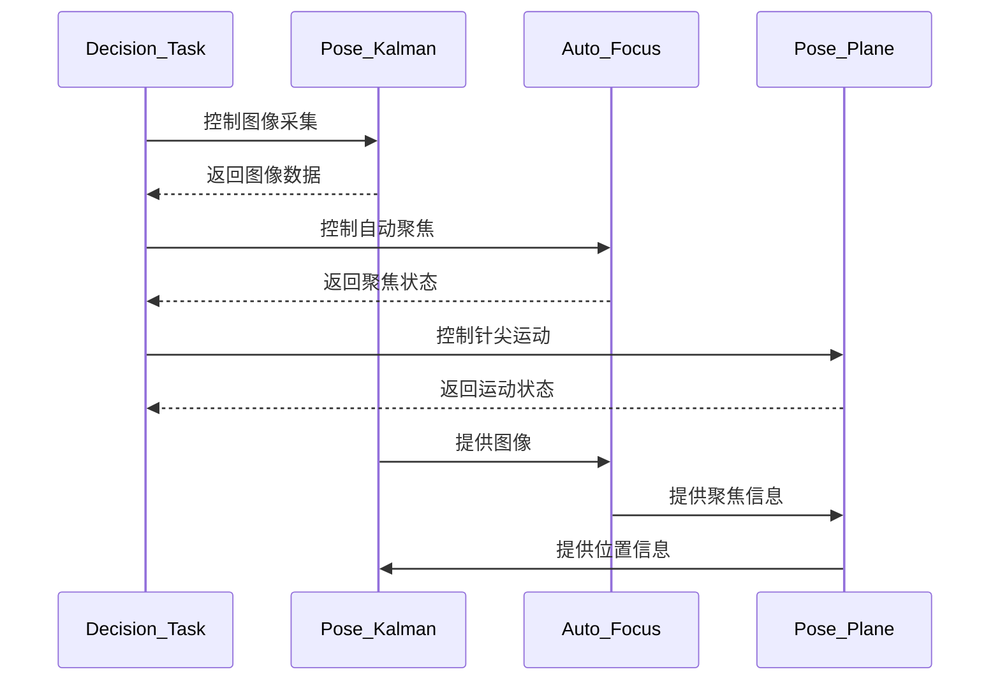
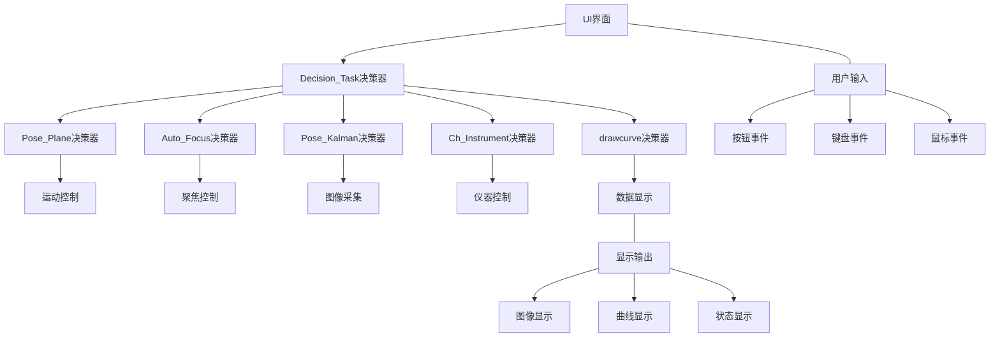
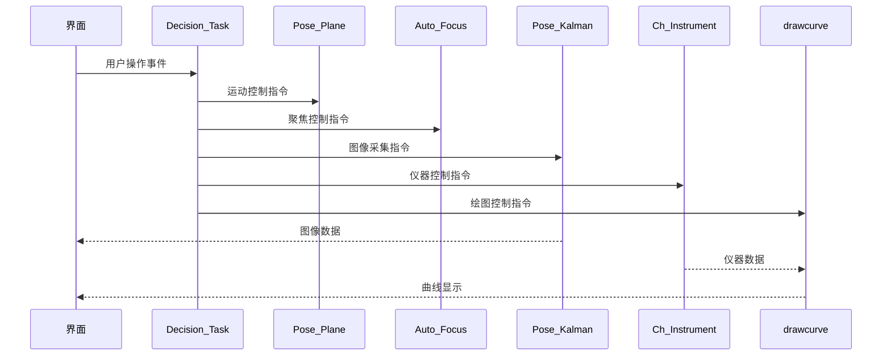

# Auto_Focus::decision()函数中的状态值和功能实现，以及与线程的关系：

-------------------------------------------------------------------------------

# Pose_Plane::decision()函数中的状态值和功能实现，以及它们与线程的关系：

1. 状态机基本工作流程：



2. 线程和状态值关系：



3. 主要功能组说明：

A. 初始化功能组：
- state_init: 系统初始化
  - 设置控制对象
  - 初始化定时器
  - 启动运行循环

B. 定位功能组：
- state_nonOvershootPositioning: 无超调定位
- state_coordinateTransformation: 坐标转换
  - coordinateTransformation: 基本转换
  - coordinateTransformationclick: 基于点击
  - coordinateTransformationdeep: 基于深度学习
  - coordinateTransformationLsq: 基于最小二乘

C. 检测控制组：
- state_touchDetection: 接触检测
  - touchDetection: 基本检测
  - touchDetectionclick: 基于点击
  - touchDetectionmitochondria: 线粒体检测
  - touchDetectionmitochondriamoment: 基于质心

D. 运动控制组：
- state_moveOut/state_moveIn: 移出/移入控制
- state_semiAutoBiopsy: 半自动活检
- state_manualmove: 手动控制

E. 特殊功能组：
- state_electrochemicalMapping: 电化学映射
- state_gigaseal: 膜片钳封接
- state_verification: 线粒体控制

4. 状态机的线程特点：

- 在独立线程中运行
- 通过100ms定时器触发状态检查
- 状态转换通过修改planeSelection实现
- 各状态函数相互独立运行
- 可以处理异步事件和信号

5. 线程同步机制：



这种设计实现了：
1. 功能模块的解耦
2. 实时响应能力
3. 状态切换的灵活性
4. 异步处理的可靠性
——---------------------------------------------
让我分析这几个decision()函数的关系和功能：

1. Decision_Task::decision_task_run() (顶层任务分发器)：


2. Pose_Plane::decision() (针尖控制状态机)：


3. Auto_Focus::decision() (自动聚焦状态机)：


4. Pose_Kalman::decision() (卡尔曼滤波状态机)：
主要实现图像采集和处理的功能。

主要区别和联系：

1. 层级关系：
- Decision_Task：最顶层任务分发器
- Pose_Plane：针尖控制模块
- Auto_Focus：自动聚焦模块  
- Pose_Kalman：图像采集模块

2. 功能实现：

Pose_Plane实现的主要功能：
```cpp
// 定位相关
coordinateTransformation() // 坐标转换
touchDetection() // 接触检测
tipFocusing() // 针尖聚焦

// 运动控制
penetration() // 穿刺控制
manualmove() // 手动移动
moveIn/moveOut() // 进退控制

// 特殊功能
electrochemicalmapping() // 电化学映射
semiAutoBiopsy() // 半自动活检
mitocontrol() // 线粒体控制
```

Auto_Focus实现的主要功能：
```cpp
// 聚焦相关
coarseAdjust() // 粗调焦
fineAdjust() // 精调焦
cellAutofocus() // 细胞聚焦

// 细胞处理
cellDetection() // 细胞检测  
pathPlaning() // 路径规划
imageStitching() // 图像拼接

// 深度学习
celldeep() // 细胞深度学习
realtimedeep() // 实时检测

// 3D扫描
mitoscaningROI() // ROI扫描
deconwolfconvo() // 反卷积
```

3. 变量对应：

Pose_Plane使用的主要变量：
```cpp
planeSelection // 状态选择
line2DParams // 设备参数
tipRight // 针尖位置
mouseRatio // 鼠标位置
```

Auto_Focus使用的主要变量：
```cpp
Auto_Focus_Slect // 状态选择
cellPosition // 细胞位置
focusMeasure // 清晰度测量
barycenterAll // 质心位置
```

4. 定时器配置：
```cpp
Pose_Plane: 100ms定时器
Auto_Focus: 50ms定时器
```

这种多状态机的设计实现了：
1. 任务的分层控制
2. 功能的模块化封装
3. 实时的响应能力
4. 灵活的状态切换
5. 可靠的任务协调

通过这种设计，系统能够协调完成从细胞定位、针尖控制到自动聚焦的一系列复杂操作。
-----------------------------------------------------------------------
让我详细分析这四个decision()函数的联系、区别和具体实现：

1. Pose_Kalman::decision()
主要功能：图像采集和相机控制
```cpp
主要状态(funSelect)：
case 100: // 初始化50ms定时器
case 1,2,3: // verticalMove相关控制
case 4: // uiShow 图像显示
case 5: // 白平衡和曝光控制
case 6,7,8: // 相机控制(搜索、打开、显示)

主要指针变量：
- timerKalman: 定时器指针
- cameracontrol: 相机控制指针
- Image_Control: 图像控制指针

关键函数：
- verticalMove(): 垂直移动控制
- uiShow(): UI显示
- whiteAndExposure(): 白平衡曝光
- nikoncamerashow(): 相机显示
```

2. Pose_Plane::decision() 
主要功能：针尖定位和运动控制
```cpp
主要状态(planeSelection)：
case state_init: // 初始化100ms定时器
case state_coordinateTransformation: // 坐标转换
case state_touchDetection: // 接触检测
case state_penetration: // 穿刺控制
case state_tipFocusing: // 针尖聚焦

主要指针变量：
- timePoseXY: 定时器指针
- line2DParams: 设备参数
- Image_Control: 图像控制指针
- tipRight: 针尖位置点

关键函数：
- coordinateTransformationLsq(): 坐标转换
- touchDetectionmitochondriamoment(): 接触检测
- tipFocusing(): 针尖聚焦
- moveOut()/moveIn(): 进退控制
```

3. Auto_Focus::decision()
主要功能：自动聚焦和细胞检测
```cpp
主要状态(Auto_Focus_Slect)：
case 100: // 初始化50ms定时器
case state_coarseAdjust: // 粗调焦
case state_fineAdjust: // 精调焦
case state_cellDetection: // 细胞检测
case state_deeplearning: // 深度学习处理

主要指针变量：
- timeAutoF: 定时器指针
- cellParams: 细胞参数
- focusParams: 聚焦参数

关键函数：
- coarseAdjust(): 粗调焦
- fineAdjust(): 精调焦
- cellDetection(): 细胞检测
- celldeep(): 深度学习处理
```

4. Decision_Task::decision()
主要功能：顶层任务调度
```cpp
功能：
- 协调其他三个决策器
- 管理整体工作流程
- 任务分发控制

主要指针变量：
- pose_plane: Pose_Plane类指针
- A_Focus: Auto_Focus类指针
- imageCollect: Pose_Kalman类指针

调用关系：
- 控制Pose_Plane执行针尖操作
- 控制Auto_Focus执行聚焦
- 控制Pose_Kalman执行图像采集
```

三者协作关系：



主要区别：

1. 功能定位不同：
- Pose_Kalman: 图像采集和相机控制
- Pose_Plane: 针尖定位和运动控制  
- Auto_Focus: 自动聚焦和细胞检测
- Decision_Task: 顶层任务调度

2. 定时器设置：
- Pose_Kalman: 50ms
- Pose_Plane: 100ms
- Auto_Focus: 50ms

3. 状态机变量：
- Pose_Kalman: funSelect
- Pose_Plane: planeSelection 
- Auto_Focus: Auto_Focus_Slect

4. 数据流向：
- Pose_Kalman -> Auto_Focus: 图像数据
- Auto_Focus -> Pose_Plane: 聚焦信息
- Pose_Plane -> Decision_Task: 状态反馈

通过这种多状态机设计，实现了:
1. 功能模块化
2. 任务解耦
3. 实时控制
4. 可靠执行
5. 灵活扩展

-------------------------------------------------------------------------
经过分析，这些decision函数构成了一个分层的状态机控制系统，我来详细解释它们之间的联系和与UI的关系：

1. Decision_Task::decision_task_run() - 顶层决策控制器
```cpp
主要功能：
- 系统最高层控制器
- 通过funSelect变量控制子系统
- 响应UI界面的各类操作请求
- 协调其他几个decision的运行

与UI的关联:
- 响应按钮事件，如:
  ui->fullyStart - 开始自动化流程
  ui->NextAction - 执行子任务
  ui->ImageAdjust - 图像自动校准
```

2. Pose_Plane::decision() - 运动控制决策器
```cpp
主要功能：
- 通过planeSelection控制不同的运动状态
- 实现针尖定位、坐标转换等功能
- 处理触摸检测和穿刺控制

与UI的关联:
- 响应手动控制按钮:
  ui->X_up/down - X轴运动
  ui->Y_up/down - Y轴运动
  ui->Z_up/down - Z轴运动
- 响应自动化操作:
  ui->touchBox - 切换接触检测模式
  ui->penetration - 穿刺控制
```

3. Auto_Focus::decision() - 自动聚焦决策器 
```cpp
主要功能：
- 通过Auto_Focus_Slect控制聚焦状态
- 实现粗调焦和精调焦
- 处理细胞检测等功能

与UI的关联:
- 响应聚焦控制:
  ui->focusup - 向上聚焦
  ui->focusdown - 向下聚焦
- 显示聚焦状态和图像
```

4. Pose_Kalman::decision() - 图像采集决策器
```cpp
主要功能：
- 通过funSelect控制相机操作
- 处理图像采集和显示
- 实现相机参数控制

与UI的关联:
- 响应相机控制:
  ui->connect - 连接相机
  ui->capture - 开始采集
  ui->Close - 关闭相机
- 显示采集的图像
```

5. Ch_Instrument::decision() - 仪器控制决策器
```cpp
主要功能：
- 通过chiSelection控制仪器状态
- 处理仪器数据采集
- 实现TCP通信

与UI的关联:
- 显示仪器状态
- 数据曲线显示
```

6. drawcurve::decision() - 绘图控制决策器
```cpp
主要功能：
- 通过curveSelection控制绘图状态
- 实现数据曲线绘制
- 处理实时数据显示

与UI的关联:
- 响应绘图控制:
  ui->resistance_voltage - 电压曲线
  ui->currentstart - 电流曲线
  ui->motorPos - 位置曲线
```

它们之间的关系图：



数据流向：


信号槽连接：
```cpp
// 图像显示连接
connect(imageCollect, &Pose_Kalman::sendImage, this, &MainWindow::showImage);

// 状态显示连接
connect(patchClampX, &patchclamp::sendState, this, &MainWindow::showState);

// 数据曲线连接 
connect(Drawcurve, &drawcurve::timeToAddData, this, &MainWindow::timeToAddData);

// 手动控制连接
connect(this, &MainWindow::sendManualControl, decision_task, &Decision_Task::manualMoveControl);
```

这种多状态机的设计实现了:
1. 功能模块化分离
2. 实时响应控制
3. 数据流管理
4. 状态同步协调
5. 用户交互处理

每个决策器通过各自的状态变量(funSelect、planeSelection、Auto_Focus_Slect等)来控制其内部状态，而Decision_Task作为顶层控制器协调各个子系统的工作。整个系统通过Qt的信号槽机制实现了界面交互和数据传递。
-------------------------------------------------------------

让我通过代码搜索来查找所有decision相关的函数：通过分析代码，我找到了几个关键的decision()函数,它们之间的关系和功能如下:

1. Decision_Task::decision_task_run() - 顶层决策控制
```cpp
- 功能：整体任务调度器
- 主要职责：
  - 协调其他几个decision的运行
  - 处理UI界面的各种任务请求(funSelect)
  - 负责不同模块间的通信
```

2. Pose_Kalman::decision() - 图像采集控制
```cpp
- 功能：相机控制和图像处理
- 通过funSelect控制：
  case 6: 搜索相机设备
  case 7: 打开相机
  case 8: 开始图像采集和显示
  case 9: 图像录制
```

3. Pose_Plane::decision() - 运动控制
```cpp 
- 功能：针尖定位和运动控制
- 主要状态：
  - state_coordinateTransformation: 坐标转换
  - state_touchDetection: 接触检测  
  - state_penetration: 穿刺控制
  - state_tipFocusing: 针尖聚焦
```

4. Auto_Focus::decision() - 自动聚焦控制
```cpp
- 功能：自动聚焦和细胞检测
- 主要状态：
  - state_coarseAdjust: 粗调焦
  - state_fineAdjust: 精调焦  
  - state_cellDetection: 细胞检测
```

5. feedBack::decision() - 反馈控制
```cpp
- 功能：系统反馈和状态监控
- 主要状态：
  case 1: 电机位置反馈
  case 2: 微操作器位置反馈
  case 3: 接触检测反馈
  case 4: 聚焦反馈
```

与UI界面的关联:

1. MainWindow中的按钮事件与各decision的关系:
```cpp
- on_capture_clicked(): 触发图像采集 (Pose_Kalman::decision)
- on_fullyStart_clicked(): 开始自动化流程 (Decision_Task::decision_task_run) 
- on_touchBox_currentIndexChanged(): 切换接触检测模式 (Pose_Plane::decision)
- on_focusup_clicked(): 控制对焦 (Auto_Focus::decision)
```

2. 信号槽连接:
```cpp
// 图像显示
connect(decision_task->imageCollect, &Pose_Kalman::sendImage, this, &MainWindow::showImage);

// 状态显示  
connect(decision_task->A_Focus, &Auto_Focus::sendState, this, &MainWindow::showState);

// 鼠标控制
connect(this, &MainWindow::sendManualControl, decision_task, &Decision_Task::manualMoveControl);
```

3. 参数传递:
```cpp
// UI参数设置传递到各个decision
decision_task->pose_plane->touchthresh = arg1;  
decision_task->imageCollect->funSelect = 8;
decision_task->A_Focus->Auto_Focus_Slect = state_deeplearning;
```

这种多状态机的设计实现了:
1. UI交互与底层控制的分离
2. 各功能模块的独立运行
3. 模块间的协同工作
4. 系统的实时响应
5. 状态的可靠切换

整体构成了一个完整的闭环控制系统。
