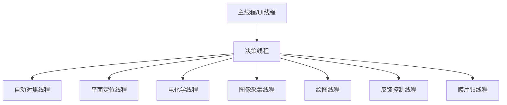
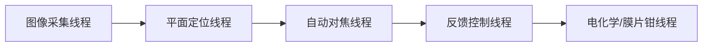
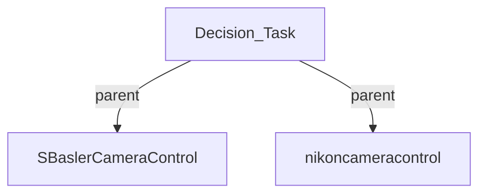

# **让我分析这个decision_task的决策任务系统的线程结构：**

# 1. 主要线程及其创建顺序



# 2. 线程创建代码

1. **自动对焦线程**:

```cpp
QThread* afocusThread = new QThread;
A_Focus->moveToThread(afocusThread);
connect(afocusThread, &QThread::started, A_Focus, &Auto_Focus::decision);
```

2. **平面定位线程**:

```cpp
QThread* planeThread = new QThread;
pose_plane->moveToThread(planeThread);
connect(planeThread, &QThread::started, pose_plane, &Pose_Plane::decision);
```

3. **其他线程**类似创建方式

# 3. 线程间关系

1. **并行执行**:

- 所有线程创建后并行运行
- 通过信号槽机制通信
- 各自负责不同功能模块

2. **数据流向**:



# 4. decision_task_run() 函数分析

```cpp
void Decision_Task::decision_task_run() {
    // 1. 创建定时器
    timer = new QTimer();
    timer->setInterval(50);  // 50ms循环
    connect(timer, &QTimer::timeout, this, &Decision_Task::decision_task_run);
    
    // 2. 状态机处理
    switch (funSelect) {
        case 100:  // 初始化
            // ...
        case 4:   // 半自动模式
            // ...
        // ...其他状态
    }
}
```

**循环运行含义**:

1. 通过QTimer每50ms触发一次
2. 检查系统状态(funSelect)
3. 根据状态执行相应操作
4. 完成后等待下一次触发

这是一个典型的状态机实现，用于:

1. 协调各个线程工作
2. 处理用户输入
3. 执行自动/半自动操作流程
4. 管理系统状态转换
# QUESTION:

    m_control=new SBaslerCameraControl(this);//相机模块
    //    ndiTrack=new ndiTracking;
        //nikon camera
        nikoncamera = new nikoncameracontrol(this);这两个this是啥意思，是同一个吗？

这两个`this`都是指向当前`Decision_Task`类的实例指针，但用途不同：

1. **第一个this**:

```cpp
m_control = new SBaslerCameraControl(this);
```

这里的`this`作为BaslerCamera的父对象传入，表示：

- BaslerCamera是Decision_Task的子对象
- 当Decision_Task被销毁时，BaslerCamera也会被自动销毁
- BaslerCamera可以访问Decision_Task的信号和槽

2. **第二个this**:

```cpp
nikoncamera = new nikoncameracontrol(this);
```

同样作为父对象传入，表示：

- NikonCamera是Decision_Task的子对象
- 建立对象层次关系
- 实现内存管理

它们的关系可以这样表示：



在Qt中，`this`作为父对象参数的作用：

1. **对象树管理**：

```cpp
class Decision_Task : public QObject {
    SBaslerCameraControl *m_control;
    nikoncameracontrol *nikoncamera;
    
    Decision_Task() {
        // 两个相机都成为Decision_Task的子对象
        m_control = new SBaslerCameraControl(this);
        nikoncamera = new nikoncameracontrol(this);
    }
};
```

2. **内存管理**：

- 子对象会随父对象自动删除
- 避免内存泄漏
- 确保对象生命周期正确管理

3. **信号槽连接**：

- 子对象可以与父对象建立信号槽连接
- 实现对象间通信

所以虽然是同一个`this`指针，但在Qt的对象体系中起到了重要的组织作用。
