# **让我分析这个decision_task的决策任务系统的线程结构：**

# 1. 主要线程及其创建顺序

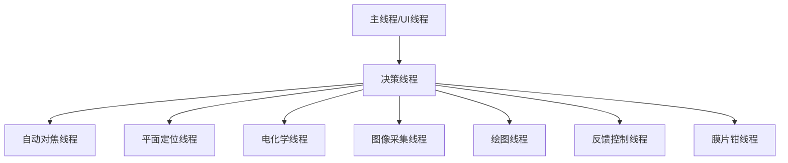

# 2. 线程创建代码

1. **自动对焦线程**:

```cpp
QThread* afocusThread = new QThread;
A_Focus->moveToThread(afocusThread);
  connect(afocusThread, &QThread::finished, afocusThread, &QThread::deleteLater);
    connect(afocusThread,&QThread::started,A_Focus,&Auto_Focus::decision);
    afocusThread->start();
```

2. **平面定位线程**:

```cpp
    pose_plane=new Pose_Plane(A_Focus,m_control,nikoncamera,params);//平面定位模块
    QThread* planeThread = new QThread;
    pose_plane->moveToThread(planeThread);
    connect(planeThread, &QThread::finished, planeThread, &QThread::deleteLater);
    connect(planeThread,&QThread::started,pose_plane,&Pose_Plane::decision);
    connect(pose_plane,&Pose_Plane::sendpoint,A_Focus,&Auto_Focus::receivepoints);//接受三角形的顶点
    planeThread->start();
```

3. **电化学模块**

```cpp
   ch_instrument=new Ch_Instrument();//电化学模块
    QThread* chiThread = new QThread;
    ch_instrument->moveToThread(chiThread);
    connect(chiThread, &QThread::finished, chiThread, &QThread::deleteLater);
    connect(chiThread,&QThread::started,ch_instrument,&Ch_Instrument::decision);
    connect(ch_instrument,&Ch_Instrument::currentmutation,pose_plane,&Pose_Plane::touchCurrentMutation);
    connect(ch_instrument,&Ch_Instrument::dataGet,pose_plane,&Pose_Plane::sicmData);
    chiThread->start();
```

4. **驱动采集图像**

```cpp

    imageCollect=new Pose_Kalman(m_control,nikoncamera,paramsfeed);//驱动采集图像
    QThread* imageCollectThread = new QThread;
    imageCollect->moveToThread(imageCollectThread);
    connect(imageCollectThread, &QThread::finished, imageCollectThread, &QThread::deleteLater);
    connect(imageCollectThread,&QThread::started,imageCollect,&Pose_Kalman::decision);
    connect(pose_plane,&Pose_Plane::sendTarget,imageCollect,&Pose_Kalman::receiveTargetP);
    imageCollectThread->start();

    connect(A_Focus, &Auto_Focus::afOver, this, &Decision_Task::decisionSelect);
```
5. **绘图线程 **

```cpp
     // 绘图进程
    Drawcurve = new drawcurve(plotdecision,plotdecision2,plotdecision3);
    QThread* drawcurveThread = new QThread;
    imageCollect->moveToThread(drawcurveThread);
    connect(drawcurveThread, &QThread::finished, drawcurveThread, &QThread::deleteLater);
    connect(drawcurveThread,&QThread::started,Drawcurve,&drawcurve::decision);
    drawcurveThread->start();
```
5. **反馈层模块**

```cpp
    backinit();
    feedback = new feedBack(hMCCmsg,vsmd,device,params);
    QThread* feedbackThread = new QThread;
    imageCollect->moveToThread(feedbackThread);
    connect(feedbackThread, &QThread::finished, feedbackThread, &QThread::deleteLater);
    connect(feedbackThread,&QThread::started,feedback,&feedBack::decision);
    feedbackThread->start();
    connect(feedback,&feedBack::sendresistance,Drawcurve,&drawcurve::receiveresistance);
    connect(feedback,&feedBack::sendcurrent,Drawcurve,&drawcurve::receivecurrent);
    connect(feedback,&feedBack::sendposition,Drawcurve,&drawcurve::receiveposition);
```
6. **驱动层模块**

```cpp
       patchClampX=new patchclamp(hMCCmsg,vsmd,device,priorSDK);//驱动层
    QThread* patchThread = new QThread;
    patchClampX->moveToThread(patchThread);
    connect(patchThread, &QThread::finished, patchClampX, &patchclamp::pcStop);
    connect(patchThread, &QThread::finished, patchThread, &QThread::deleteLater);
    connect(patchThread,&QThread::started,patchClampX,&patchclamp::decision);
    connect(pose_plane,&Pose_Plane::sendVoltage,patchClampX,&patchclamp::pcSetVoltage);
    connect(patchClampX,&patchclamp::currentmutation,pose_plane,&Pose_Plane::touchCurrentMutation);
//    connect(ch_instrument,&Ch_Instrument::dataGet,pose_plane,&Pose_Plane::sicmData);
    patchThread->start();
```

# 3. 线程间关系

1. **并行执行**:

- 所有线程创建后并行运行
- 通过信号槽机制通信
- 各自负责不同功能模块

2. **数据流向**:

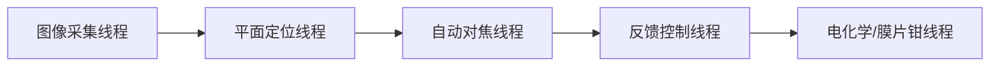

# 4. decision_task_run() 函数分析

```cpp
void Decision_Task::decision_task_run() {
    // 1. 创建定时器
    timer = new QTimer();
    timer->setInterval(50);  // 50ms循环
    connect(timer, &QTimer::timeout, this, &Decision_Task::decision_task_run);
    
    // 2. 状态机处理
    switch (funSelect) {
        case 100:  // 初始化
            // ...
        case 4:   // 半自动模式
            // ...
        // ...其他状态
    }
}
```

**循环运行含义**:

1. 通过QTimer每50ms触发一次
2. 检查系统状态(funSelect)
3. 根据状态执行相应操作
4. 完成后等待下一次触发

这是一个典型的状态机实现，用于:

1. 协调各个线程工作
2. 处理用户输入
3. 执行自动/半自动操作流程
4. 管理系统状态转换
# QUESTION:

    m_control=new SBaslerCameraControl(this);//相机模块
    //    ndiTrack=new ndiTracking;
        //nikon camera
        nikoncamera = new nikoncameracontrol(this);这两个this是啥意思，是同一个吗？

这两个`this`都是指向当前`Decision_Task`类的实例指针，但用途不同：

1. **第一个this**:

```cpp
m_control = new SBaslerCameraControl(this);
```

这里的`this`作为BaslerCamera的父对象传入，表示：

- BaslerCamera是Decision_Task的子对象
- 当Decision_Task被销毁时，BaslerCamera也会被自动销毁
- BaslerCamera可以访问Decision_Task的信号和槽

2. **第二个this**:

```cpp
nikoncamera = new nikoncameracontrol(this);
```

同样作为父对象传入，表示：

- NikonCamera是Decision_Task的子对象
- 建立对象层次关系
- 实现内存管理

它们的关系可以这样表示：

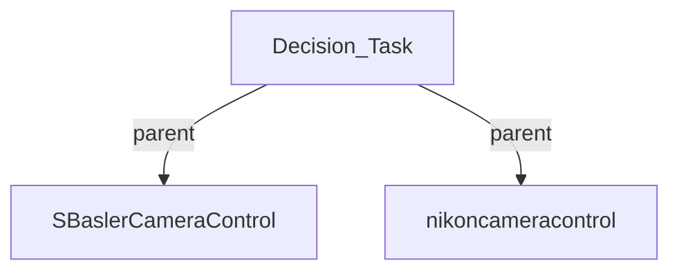

在Qt中，`this`作为父对象参数的作用：

1. **对象树管理**：

```cpp
class Decision_Task : public QObject {
    SBaslerCameraControl *m_control;
    nikoncameracontrol *nikoncamera;
    
    Decision_Task() {
        // 两个相机都成为Decision_Task的子对象
        m_control = new SBaslerCameraControl(this);
        nikoncamera = new nikoncameracontrol(this);
    }
};
```

2. **内存管理**：

- 子对象会随父对象自动删除
- 避免内存泄漏
- 确保对象生命周期正确管理

3. **信号槽连接**：

- 子对象可以与父对象建立信号槽连接
- 实现对象间通信

所以虽然是同一个`this`指针，但在Qt的对象体系中起到了重要的组织作用。
让我详细解释这段自动对焦线程创建的代码：

# 1. 创建对象
```cpp
// 创建自动对焦对象，传入:
A_Focus = new Auto_Focus(
    m_control,      // Basler相机控制器
    nikoncamera,    // Nikon相机控制器
    params          // 运动参数
);
```

# 2. 创建线程
```cpp
QThread* afocusThread = new QThread;  // 创建Qt线程对象
```

# 3. 对象移动到线程
```cpp
A_Focus->moveToThread(afocusThread);  // 将自动对焦对象移动到新线程
```

# 4. 信号槽连接
```cpp
// 连接1: 线程结束时的清理
connect(afocusThread,              // 信号发送者
        &QThread::finished,        // 线程完成信号
        afocusThread,             // 信号接收者
        &QThread::deleteLater);   // 延迟删除槽函数

// 连接2: 线程启动时开始对焦任务
connect(afocusThread,             // 信号发送者
        &QThread::started,        // 线程启动信号
        A_Focus,                  // 信号接收者
        &Auto_Focus::decision);   // 开始对焦决策
```

# 5. 启动线程
```cpp
afocusThread->start();  // 启动线程，触发started信号
```

工作流程图：
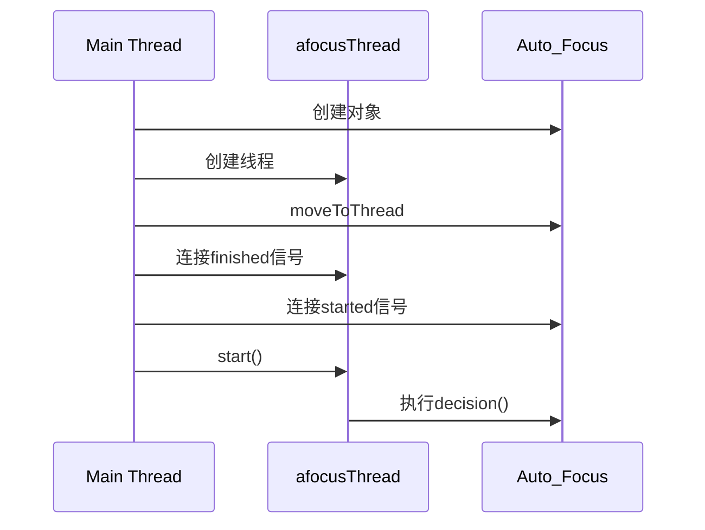

关于 `deleteLater()`：
1. Qt的延迟删除机制
2. 对象会在事件循环返回主线程时被删除
3. 安全地清理线程资源
4. 避免线程正在运行时删除对象

`start()` 函数的作用：
1. 启动线程
2. 触发 started 信号
3. 开始线程的事件循环
4. 在新线程中执行 Auto_Focus::decision

这样实现了:
1. 自动对焦在独立线程运行
2. 不阻塞主线程/UI
3. 资源的安全管理
4. 优雅的线程终止

###让我详细解释 `afocusThread` 和 `A_Focus` 的关系：

它们是两个不同的对象：

1. **afocusThread**
```cpp
// Qt线程对象
QThread* afocusThread = new QThread;  // 创建一个新的线程容器
```

2. **A_Focus**
```cpp
// 自动对焦功能类对象
A_Focus = new Auto_Focus(m_control, nikoncamera, params);  // 创建功能对象
```

他们的关系是：
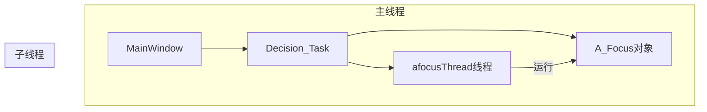

工作过程：
1. **创建阶段**
```cpp
// 在主线程中
A_Focus = new Auto_Focus(...);        // 创建功能对象
QThread* afocusThread = new QThread;  // 创建线程容器
```

2. **移动阶段**
```cpp
// 将功能对象移动到线程容器中
A_Focus->moveToThread(afocusThread);
```

3. **连接阶段**
```cpp
// 当线程启动时，执行A_Focus的decision函数
connect(afocusThread,        // 信号发送者(线程)
        &QThread::started,   // 线程启动信号
        A_Focus,            // 信号接收者(功能对象)
        &Auto_Focus::decision); // 要执行的函数
```

4. **启动阶段**
```cpp
afocusThread->start();  // 启动线程，此时会触发started信号
```

所以：
- `afocusThread` 是线程容器
- `A_Focus` 是在该线程中运行的功能对象
- 它们不是同一个东西，而是"容器"和"内容"的关系
----------------------------------------------------------------------
在这个项目中，主线程(Main Thread)主要是UI线程，让我用图解说明整个线程结构：

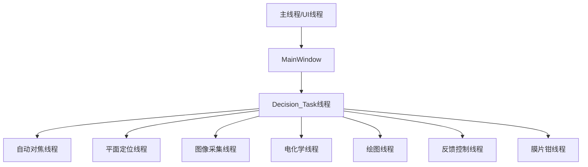

主线程的主要职责：

1. **UI界面管理**
```cpp
class MainWindow : public QMainWindow {
    // ...主窗口初始化
    MainWindow::MainWindow(QWidget *parent) :
        QMainWindow(parent),
        ui(new Ui::MainWindow) {
        ui->setupUi(this);  // 设置UI
        
        // 创建决策任务
        decision_task = new Decision_Task(...);
    }
};
```

2. **创建和管理子线程**
```cpp
// 在主线程中创建决策线程
QThread* subThread = new QThread;
decision_task->moveToThread(subThread);
```

3. **信号槽连接**
```cpp
// 主线程中建立信号槽连接
connect(decision_task->pose_plane, &Pose_Plane::sendImage,
        this, &MainWindow::showImage);
```

4. **处理用户输入**
```cpp
// 处理用户界面事件
void MainWindow::on_startButton_clicked() {
    decision_task->decisionSelect(4);  // 启动半自动模式
}
```

主线程特点：
1. 负责UI交互
2. 创建和管理其他线程
3. 处理用户事件
4. 协调各个功能模块

所有其他线程都是由主线程创建和管理的，这保证了系统的稳定性和响应性。
让我用图表来解释这些线程的关系：

# 1. 所有线程及其关系

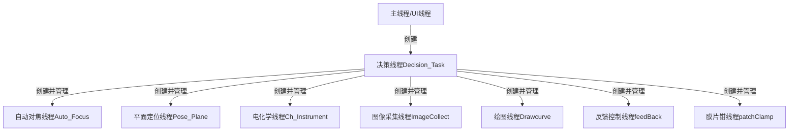

# 2. 线程间的数据流

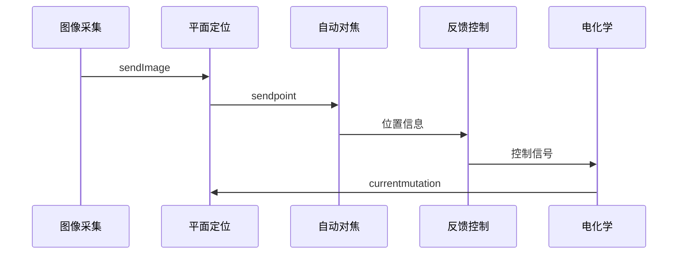

# 3. 线程功能和依赖关系

1. **图像采集线程**
```cpp
// 最基础的数据源
imageCollect = new Pose_Kalman(m_control, nikoncamera, paramsfeed);
```

2. **平面定位线程**
```cpp
// 依赖图像采集线程的数据
connect(pose_plane, &Pose_Plane::sendTarget, 
        imageCollect, &Pose_Kalman::receiveTargetP);
```

3. **自动对焦线程**
```cpp
// 依赖平面定位的结果
connect(pose_plane, &Pose_Plane::sendpoint,
        A_Focus, &Auto_Focus::receivepoints);
```

4. **反馈控制线程**
```cpp
// 接收多个线程的数据进行综合控制
connect(feedback, &feedBack::sendresistance, 
        Drawcurve, &drawcurve::receiveresistance);
```

5. **电化学/膜片钳线程**
```cpp
// 与平面定位线程交互
connect(ch_instrument, &Ch_Instrument::currentmutation,
        pose_plane, &Pose_Plane::touchCurrentMutation);
```

主要工作流程：
1. 图像采集获取原始数据
2. 平面定位处理图像数据
3. 自动对焦根据位置调整
4. 反馈控制实时调节
5. 电化学/膜片钳执行具体操作

这些线程是并行运行的，但通过信号槽机制保持同步和协调。
----------------------------------------------------------------------------------------------------------------------------
#线程之间的通讯：
让我详细解释这些connect连接：

# 1. 平面定位与自动对焦连接
```cpp
connect(pose_plane, &Pose_Plane::sendpoint, 
        A_Focus, &Auto_Focus::receivepoints);
```
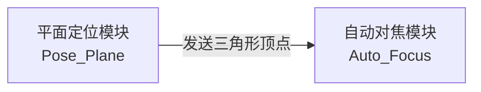
- 功能：传递针尖位置信息
- 从：平面定位发送顶点坐标
- 到：自动对焦接收并调整焦平面

# 2. 电化学与平面定位连接
```cpp
connect(ch_instrument, &Ch_Instrument::currentmutation,
        pose_plane, &Pose_Plane::touchCurrentMutation);
```
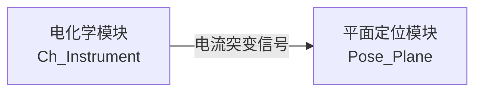
- 功能：电流监测
- 从：电化学模块检测电流变化
- 到：平面定位判断接触状态

# 3. 平面定位与图像采集连接
```cpp
connect(pose_plane, &Pose_Plane::sendTarget,
        imageCollect, &Pose_Kalman::receiveTargetP);
```
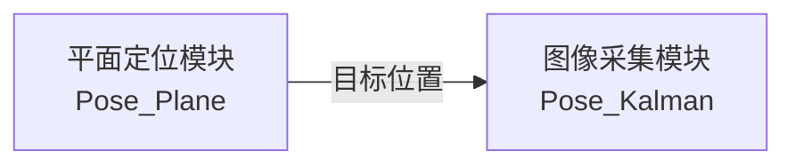
- 功能：位置跟踪
- 从：平面定位发送目标位置
- 到：图像采集调整拍摄参数

# 4. 反馈控制与绘图连接
```cpp
connect(feedback, &feedBack::sendresistance,
        Drawcurve, &drawcurve::receiveresistance);
```

- 功能：实时数据显示
- 从：反馈控制发送测量数据
- 到：绘图模块更新显示

# 5. 膜片钳控制连接
```cpp
connect(patchThread, &QThread::started,
        patchClampX, &patchclamp::decision);
connect(pose_plane, &Pose_Plane::sendVoltage,
        patchClampX, &patchclamp::pcSetVoltage);
```
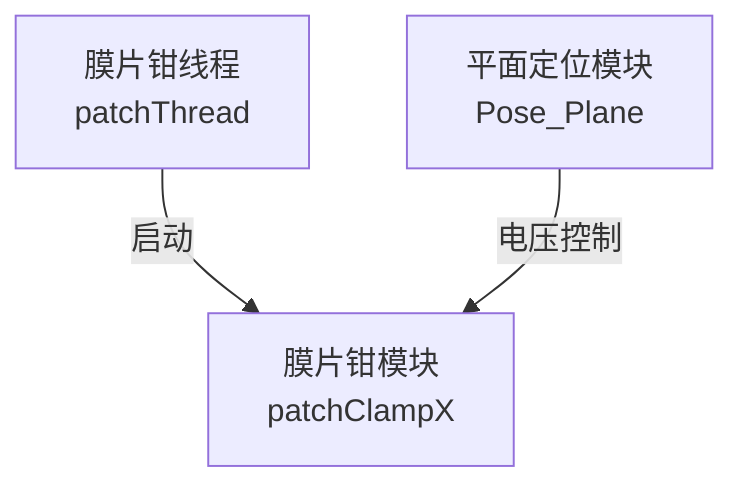
- 功能：膜片钳控制
- 线程控制：启动和停止膜片钳操作
- 电压控制：设置工作电压

主要模块功能：
1. **Pose_Plane**: 平面定位控制
2. **Auto_Focus**: 自动对焦控制
3. **Ch_Instrument**: 电化学测量
4. **Pose_Kalman**: 图像采集处理
5. **feedBack**: 反馈控制
6. **Drawcurve**: 数据可视化
7. **patchclamp**: 膜片钳控制
   --------------------------------------------------------------------------------
# 一、 `Pose_Plane` 类 (继承于algorithms类) : -position_tip.h的主要功能：

# 1. 核心功能模块

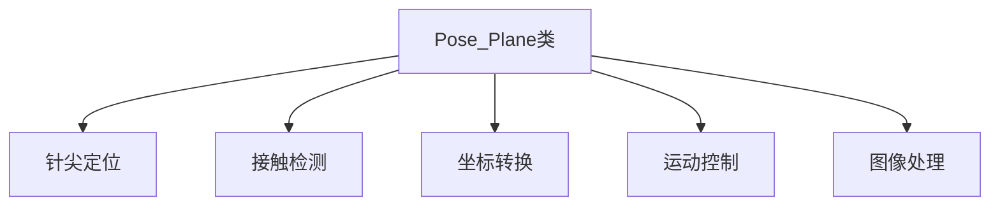

## 1.1 针尖定位
```cpp
// 相关函数
tipPositioning_new()      // 新针尖定位算法
tipPositioning_otsu()     // 基于OTSU的定位
tipPositioning_mog2()     // MOG2背景分割定位
tipsegmentation()         // 深度学习分割定位
```

## 1.2 接触检测
```cpp
// 相关函数
touchDetection()                    // 基础接触检测
touchDetectionmitochondria()        // 线粒体接触检测
touchDetectionmitochondriamoment()  // 基于质心的接触检测
```

## 1.3 坐标转换
```cpp
// 相关函数
coordinateTransformation()       // 基础坐标转换
coordinateTransformationdeep()   // 深度学习坐标转换
coordinateTransformationLsq()    // 最小二乘法坐标转换
```

# 2. 重要成员变量

```cpp
// 状态控制
int8_t planeSelection;      // 平面选择状态
int8_t touchFlag;          // 接触检测标志
int8_t transferFlag;       // 坐标转换标志

// 参数存储
params_struct line2DParams;     // 2D定位参数
params_struct touchPosition;    // 接触位置参数
Mat transformMatrix;           // 变换矩阵
```

# 3. 信号定义

```cpp
signals:
    void sendImage(const QImage &img);         // 发送图像
    void sendState(QString sState);            // 发送状态
    void sendpoint(vector<vector<Point>>);     // 发送特征点
    void sendroipoint(double x,double y,int);  // 发送ROI位置
```

# 4. 主要应用场景

1. **微操作系统中的视觉定位**
   - 针尖实时跟踪
   - 位置精确定位
   - 运动路径规划

2. **线粒体操作**
   - 接触检测
   - 运动跟踪
   - 形态分析

3. **自动化控制**
   - 坐标系转换
   - 运动控制
   - 反馈调节

这是一个集成了视觉、运动控制和自动化操作的复杂类，主要用于显微操作系统中的位置控制和运动规划。

# 二、 `Auto_Focus` 类(继承于algorithms类)  :position_cell.h 的主要功能：

# 1. 核心功能模块

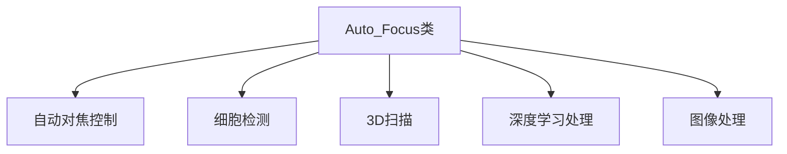

# 2. 主要功能模块详解

## 2.1 自动对焦系统
```cpp
// 相关函数
coarseAdjust()    // 粗调焦
fineAdjust()      // 精调焦
cellAutofocus()   // 细胞自动对焦
fineGetSharpness()// 获取清晰度
```

## 2.2 3D扫描和重建
```cpp
// 成员变量
int firstposition;    // 起始位置
int finalposition;    // 结束位置
int scanstep;        // 扫描步长
int scannum;         // 扫描数量

// 相关函数
mitoscaning()        // 线粒体扫描
deconwolfconvo()     // 反卷积处理
imagestack()         // 图像堆栈
```

## 2.3 深度学习处理
```cpp
// 相关组件
YOLOv8Seg* model;    // YOLO模型
std::vector<std::vector<cv::Point>> contour;  // 轮廓存储

// 相关函数
realtimedeep()       // 实时深度学习处理
celldeep()          // 细胞检测
realcluster()       // 聚类分析
```

# 3. 重要成员变量

```cpp
// 状态控制
int8_t Auto_Focus_Slect;      // 自动对焦状态选择
params_struct cellPosition;    // 细胞位置参数
params_struct verticalPosition;// 垂直位置参数

// 图像处理参数
float Array_Sharpness[Auto_Focus_Rows][Auto_Focus_Cols]; // 清晰度数组
Mat rMatrix;                  // 变换矩阵
```

# 4. 主要应用场景

1. **自动对焦系统**
   - 粗调焦和精调焦
   - 细胞自动对焦
   - 清晰度评估

2. **3D扫描重建**
   - Z轴序列扫描
   - 图像堆栈处理
   - 反卷积重建

3. **深度学习应用**
   - 细胞检测
   - 实时分析
   - 特征提取

4. **图像处理**
   - 清晰度计算
   - 图像变换
   - 特征检测

这是一个综合了光学、图像处理和深度学习的自动对焦控制类，主要用于显微镜系统的对焦控制和图像分析。

# 三、class Ch_Instrument类: Ch_Instrument.h 分析

这是一个电化学测量和通信控制类，主要功能如下：

## 1. 网络通信架构

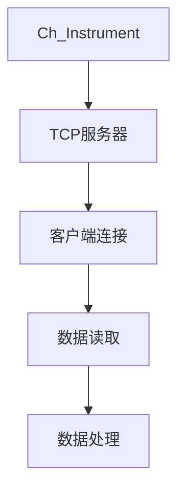

## 2. 主要组件

### 2.1 通信组件
```cpp
class Ch_Instrument {
private:
    QTcpServer *server;    // TCP服务器
    QTcpSocket *socket;    // 客户端连接
};
```

### 2.2 数据管理
```cpp
class Ch_Instrument {
private:
    queue<Point2f> chiPoint;      // 电流数据队列
    double averageCurrent;        // 平均电流值
    double sumCurrent;            // 电流累积值
};
```

### 2.3 定时控制
```cpp
class Ch_Instrument {
private:
    QTimer* timeChi;     // 电化学采样定时器
    QTimer* timeSum;     // 数据汇总定时器
};
```

## 3. 核心功能

### 3.1 数据采集与处理
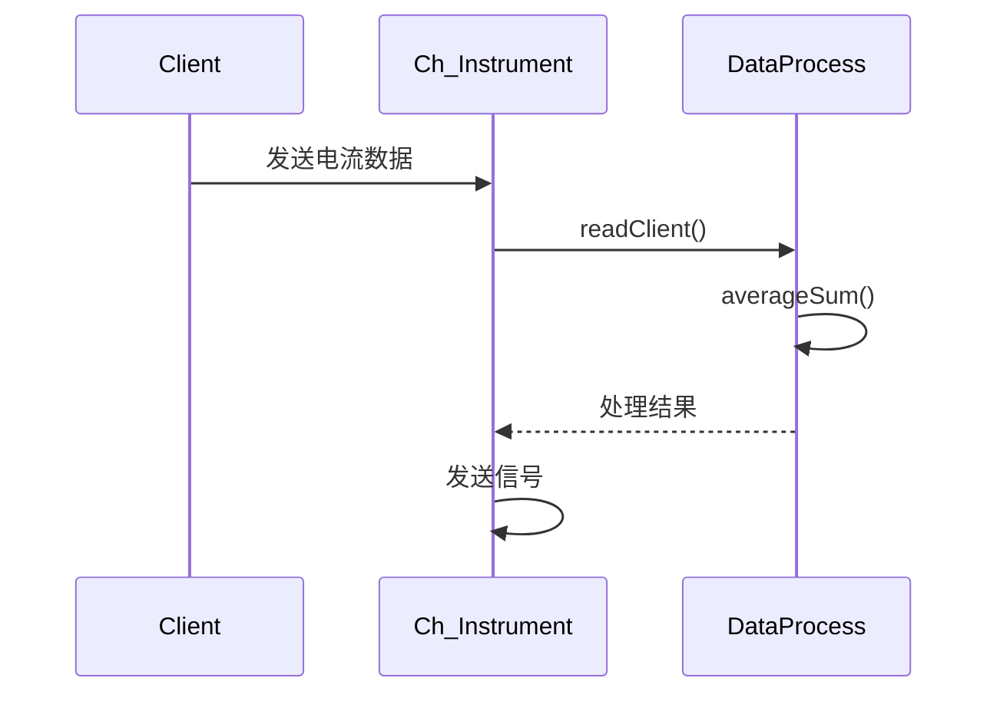

### 3.2 信号系统
```cpp
signals:
    void currentmutation();                    // 电流突变信号
    void dataGet(float current, float time);   // 数据获取信号
```

## 4. 应用场景

1. **实时监测**
   - 电流值采集
   - 突变检测
   - 数据统计

2. **网络通信**
   - TCP服务器维护
   - 数据传输
   - 连接管理

3. **数据分析**
   - 均值计算
   - 趋势分析
   - 异常检测

## 5. 工作流程
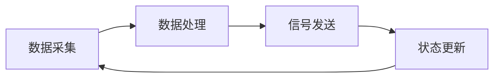

这个类是整个系统中电化学测量和数据通信的关键组件。
# 四、 Pose_Kalman类（继承于Transform_Format） Pose_Kalman.h分析

这是一个图像采集和处理的核心类，主要功能如下：

## 1. 核心功能模块

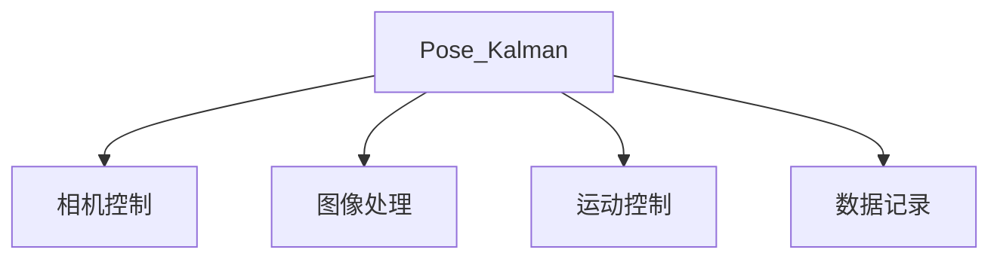

## 2. 主要组件

### 2.1 相机控制
```cpp
class Pose_Kalman {
private:
    SBaslerCameraControl *Image_Control;    // Basler相机控制
    nikoncameracontrol* cameracontrol;      // Nikon相机控制
    bool CameraRuning;                      // 相机运行状态
};
```

### 2.2 图像处理功能
```cpp
class Pose_Kalman {
public:
    // 图像增强
    bool claheopen;        // CLAHE增强开关
    bool contrastopen;     // 对比度调整开关
    int clip;             // CLAHE参数
    int Gridsize;         // 网格大小
    
    // 图像处理函数
    void contrastadjust(Mat& input, Mat& output, int contrast);
};
```

## 3. 核心功能

### 3.1 实时图像采集和显示
```cpp
void nikoncamerashow() {
    // 实时图像采集
    // ROI提取
    // 图像增强
    // UI显示
}
```

### 3.2 运动控制和扫描
```cpp
void planeMove();      // 平面运动控制
void verticalMove();   // 垂直扫描控制
```

## 4. 决策控制系统
```cpp
void decision() {
    switch (funSelect) {
        case 4:  // 实时显示
        case 5:  // 白平衡和曝光调整
        case 8:  // 尼康相机显示
        // ...其他功能
    }
}
```

## 5. 应用场景

1. **图像采集**
   - 实时图像获取
   - 多相机控制
   - 图像质量优化

2. **图像处理**
   - ROI提取
   - 对比度增强
   - CLAHE处理

3. **运动控制**
   - 平面扫描
   - Z轴扫描
   - 位置记录

4. **数据记录**
   - 图像保存
   - 视频录制
   - 位置记录

这是一个集成了图像采集、处理和运动控制的综合类，主要用于显微操作系统中的实时图像获取和处理。
#  五、 feedBack类 ，feedBack.h功能分析

## 1. 核心功能模块

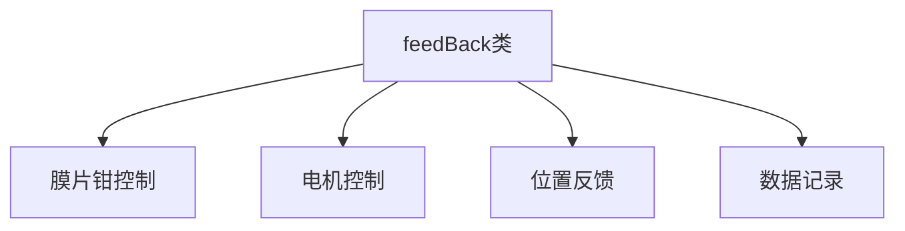

## 2. 主要组件

### 2.1 膜片钳控制
```cpp
// 膜片钳相关组件
HMCCMSG hMCCmsgfeedback;     // 膜片钳消息句柄
double resistance;           // 电阻值
double current;             // 电流值
QQueue<double> resistancesqueue;  // 电阻队列
QQueue<double> currentqueue;      // 电流队列
```

### 2.2 运动控制
```cpp
// 运动控制组件
Vsmd* vsmdF;              // 电机控制
VsmdDevice* deviceF;      // 设备控制
params_struct params1;    // 微操作器参数
```

## 3. 主要功能函数

### 3.1 数据采集
```cpp
void pcgetresistance();   // 获取电阻值
void pcgetcurrent();      // 获取电流值
int8_t pcgetposition();   // 获取电机位置
```

### 3.2 位置记录
```cpp
int8_t micromanipulatorposition();        // 常规位置记录
int8_t micromanipulatorpositionfine();    // 细致位置记录
int8_t micromanipulatorpositionfocus();   // 对焦位置记录
```

## 4. 决策控制系统
```cpp
void decision() {
    switch (backselection) {
        case 1:  // 电机位置记录
        case 2:  // 微操作器位置记录
        case 3:  // 细致位置记录
        case 4:  // 对焦位置记录
    }
}
```

## 5. 应用场景

1. **电生理测量**
   - 电阻测量
   - 电流测量
   - 数据实时反馈

2. **位置控制**
   - 电机位置记录
   - 微操作器位置跟踪
   - 运动轨迹记录

3. **数据记录**
   - 保存位置数据
   - 记录时间戳
   - 生成数据文件

这是一个综合反馈控制类，主要用于显微操作系统中的数据采集和位置控制。
# 六  patchclamp类，patchclamp.h 分析

这是一个膜片钳和运动控制的集成类，主要功能如下：

## 1. 核心功能模块

```mermaid
graph TD
    A[patchclamp类] --> B[膜片钳控制]
    A --> C[运动控制]
    A --> D[信号发生器]
    A --> E[数据采集]
```

## 2. 主要控制模块

### 2.1 膜片钳控制
```cpp
// 膜片钳基本操作
int pcStart();                    // 启动膜片钳
int pcStop();                     // 停止膜片钳
int pcSetVoltage(double voltage); // 设置电压
void pcgetresistance();          // 获取电阻
void pcgetcurrent();             // 获取电流
```

### 2.2 运动控制
```cpp
// 电机和位移台控制
int8_t motor_init();     // 电机初始化
int8_t motor_control();  // 电机控制
void stagemove();        // 位移台移动
void focusmove();        // 对焦控制
```

### 2.3 波形发生器
```cpp
// 信号发生器功能
void writeDev();         // 写入波形参数
void openDev();         // 打开设备
void closeDev();        // 关闭设备
```

## 3. 数据管理

```cpp
// 数据存储
queue<double> currentdata;      // 电流数据队列
QQueue<double> resistancesqueue;// 电阻数据队列
double sumCurrent;             // 电流总和
double averageCurrent;         // 平均电流
```

## 4. 应用场景

1. **膜片钳实验**
   - 电压控制
   - 电流测量
   - 电阻测量

2. **精确运动控制**
   - 电机驱动
   - 位移台控制
   - 对焦调节

3. **波形控制**
   - 信号生成
   - 波形调制
   - 参数设置

4. **数据采集**
   - 实时监测
   - 数据存储
   - 平均计算

这是一个综合了电生理测量和精密运动控制的类，主要用于显微操作系统中的膜片钳操作和运动控制。

# 七、drawcurve类，drawcurve.h分析

这是一个用于实时数据绘制和显示的类。主要功能如下：

## 1. 核心功能模块

```mermaid
graph TD
    A[drawcurve类] --> B[实时绘图]
    A --> C[数据记录]
    A --> D[曲线管理]
    A --> E[文件保存]
```

## 2. 主要组件

### 2.1 绘图控件
```cpp
// 三个绘图窗口
QCustomPlot* curveplot1;  // 电阻曲线
QCustomPlot* curveplot2;  // 电流曲线
QCustomPlot* curveplot3;  // 位置曲线
```

### 2.2 定时器控制
```cpp
QTimer rePlotTimer1;   // 重绘定时器1
QTimer rePlotTimer2;   // 重绘定时器2
QTimer dataTimer1;     // 数据采集定时器1
QTimer dataTimer2;     // 数据采集定时器2
QTimer dataTimer3;     // 数据采集定时器3
```

## 3. 主要功能函数

### 3.1 数据接收和处理
```cpp
// 接收数据
void receiveresistance(double resistanceslot, double time);
void receivecurrent(double currentslot, double time);
void receiveposition(int32_t position);
```

### 3.2 实时绘图
```cpp
// 绘图函数
void realtimeDataSlot();     // 电阻绘图
void realtimeDataSlot2();    // 电流绘图
void realtimeDataSlot3();    // 位置绘图
```

## 4. 数据存储

```cpp
// 文件保存
static QFile handle("resistance.txt");  // 电阻数据
static QFile handle("current.txt");     // 电流数据
static QFile handle("/txt/motorposition.txt"); // 位置数据
```

## 5. 应用场景

1. **实时数据显示**
   - 电阻监测
   - 电流监测
   - 位置跟踪

2. **数据记录**
   - 文件保存
   - 数据统计
   - 历史回放

3. **曲线绘制**
   - 多窗口显示
   - 自动缩放
   - 实时更新

这是一个用于显微操作系统中数据可视化的重要类，提供了实时数据显示和记录功能。
-----------------------------------------------------------------------------------

#各个线程中的`decision()`函数：

# 1. 各线程的decision()函数对比

```mermaid
graph TD
    A[Decision_Task] --> B[决策控制]
    C[Auto_Focus::decision] --> D[自动对焦控制]
    E[Pose_Plane::decision] --> F[平面定位控制]
    G[Ch_Instrument::decision] --> H[电化学测量]
    I[Pose_Kalman::decision] --> J[图像采集]
    K[drawcurve::decision] --> L[数据绘制]
    M[feedBack::decision] --> N[反馈控制]
    O[patchclamp::decision] --> P[膜片钳控制]
```

# 2. 各个decision()函数的具体作用

## 2.1 自动对焦线程
```cpp
// Auto_Focus::decision()
void Auto_Focus::decision() {
    switch(Auto_Focus_Slect) {
        case state_focusing:    // 执行对焦
        case state_lensdown:    // 镜头下降
        case state_lensup:      // 镜头上升
        // ...
    }
}
```

## 2.2 平面定位线程
```cpp
// Pose_Plane::decision()
void Pose_Plane::decision() {
    switch(planeSelection) {
        case state_touchDetection:  // 接触检测
        case state_penetration:     // 穿刺控制
        case state_coordinateTransformation:  // 坐标转换
        // ...
    }
}
```

## 2.3 图像采集线程
```cpp
// Pose_Kalman::decision()
void Pose_Kalman::decision() {
    switch(funSelect) {
        case 4:  // 实时显示
        case 8:  // 图像采集
        // ...
    }
}
```

## 2.4 电化学/膜片钳线程
```cpp
// Ch_Instrument::decision()
void Ch_Instrument::decision() {
    // 处理电化学测量
    // 控制膜片钳操作
}
```

# 3. 线程间的信号连接

```cpp
// 1. 平面定位到自动对焦
connect(pose_plane, &Pose_Plane::sendpoint,
        A_Focus, &Auto_Focus::receivepoints);

// 2. 电化学到平面定位
connect(ch_instrument, &Ch_Instrument::currentmutation,
        pose_plane, &Pose_Plane::touchCurrentMutation);

// 3. 平面定位到图像采集
connect(pose_plane, &Pose_Plane::sendTarget,
        imageCollect, &Pose_Kalman::receiveTargetP);
```

这些`decision()`函数虽然名字相同，但功能不同：
1. 各自处理本模块的状态机
2. 实现模块特定的功能
3. 通过信号槽机制与其他模块交互
4. 在独立线程中循环运行

这种设计使得：
1. 各模块独立运行
2. 通过信号实现同步
3. 提高系统响应性
4. 便于功能扩展
