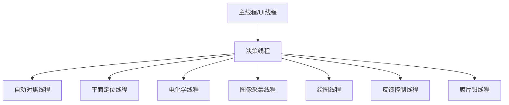
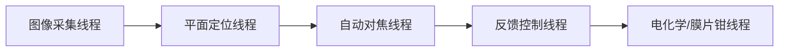
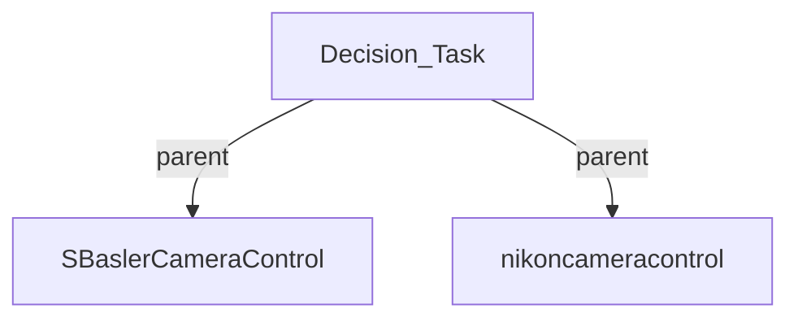
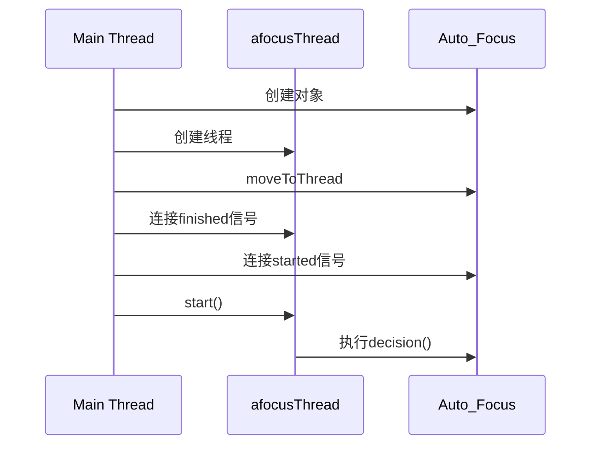
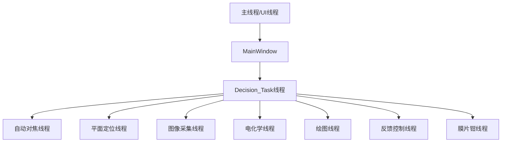
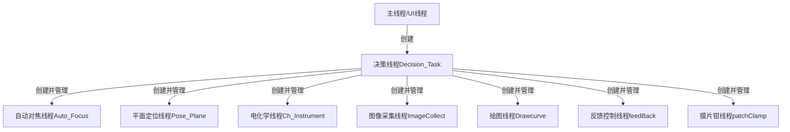
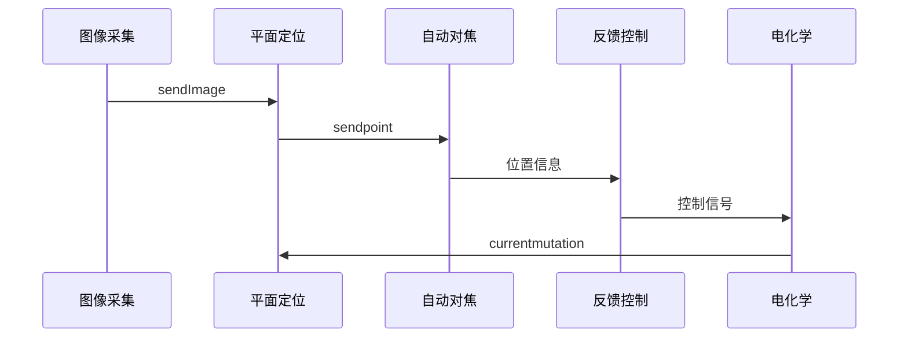

# **让我分析这个decision_task的决策任务系统的线程结构：**

# 1. 主要线程及其创建顺序



# 2. 线程创建代码

1. **自动对焦线程**:

```cpp
QThread* afocusThread = new QThread;
A_Focus->moveToThread(afocusThread);
  connect(afocusThread, &QThread::finished, afocusThread, &QThread::deleteLater);
    connect(afocusThread,&QThread::started,A_Focus,&Auto_Focus::decision);
    afocusThread->start();
```

2. **平面定位线程**:

```cpp
    pose_plane=new Pose_Plane(A_Focus,m_control,nikoncamera,params);//平面定位模块
    QThread* planeThread = new QThread;
    pose_plane->moveToThread(planeThread);
    connect(planeThread, &QThread::finished, planeThread, &QThread::deleteLater);
    connect(planeThread,&QThread::started,pose_plane,&Pose_Plane::decision);
    connect(pose_plane,&Pose_Plane::sendpoint,A_Focus,&Auto_Focus::receivepoints);//接受三角形的顶点
    planeThread->start();
```

3. **电化学模块**

```cpp
   ch_instrument=new Ch_Instrument();//电化学模块
    QThread* chiThread = new QThread;
    ch_instrument->moveToThread(chiThread);
    connect(chiThread, &QThread::finished, chiThread, &QThread::deleteLater);
    connect(chiThread,&QThread::started,ch_instrument,&Ch_Instrument::decision);
    connect(ch_instrument,&Ch_Instrument::currentmutation,pose_plane,&Pose_Plane::touchCurrentMutation);
    connect(ch_instrument,&Ch_Instrument::dataGet,pose_plane,&Pose_Plane::sicmData);
    chiThread->start();
```

4. **驱动采集图像**

```cpp

    imageCollect=new Pose_Kalman(m_control,nikoncamera,paramsfeed);//驱动采集图像
    QThread* imageCollectThread = new QThread;
    imageCollect->moveToThread(imageCollectThread);
    connect(imageCollectThread, &QThread::finished, imageCollectThread, &QThread::deleteLater);
    connect(imageCollectThread,&QThread::started,imageCollect,&Pose_Kalman::decision);
    connect(pose_plane,&Pose_Plane::sendTarget,imageCollect,&Pose_Kalman::receiveTargetP);
    imageCollectThread->start();

    connect(A_Focus, &Auto_Focus::afOver, this, &Decision_Task::decisionSelect);
```
5. **绘图线程 **

```cpp
     // 绘图进程
    Drawcurve = new drawcurve(plotdecision,plotdecision2,plotdecision3);
    QThread* drawcurveThread = new QThread;
    imageCollect->moveToThread(drawcurveThread);
    connect(drawcurveThread, &QThread::finished, drawcurveThread, &QThread::deleteLater);
    connect(drawcurveThread,&QThread::started,Drawcurve,&drawcurve::decision);
    drawcurveThread->start();
```
5. **反馈层模块**

```cpp
    backinit();
    feedback = new feedBack(hMCCmsg,vsmd,device,params);
    QThread* feedbackThread = new QThread;
    imageCollect->moveToThread(feedbackThread);
    connect(feedbackThread, &QThread::finished, feedbackThread, &QThread::deleteLater);
    connect(feedbackThread,&QThread::started,feedback,&feedBack::decision);
    feedbackThread->start();
    connect(feedback,&feedBack::sendresistance,Drawcurve,&drawcurve::receiveresistance);
    connect(feedback,&feedBack::sendcurrent,Drawcurve,&drawcurve::receivecurrent);
    connect(feedback,&feedBack::sendposition,Drawcurve,&drawcurve::receiveposition);
```
6. **驱动层模块**

```cpp
       patchClampX=new patchclamp(hMCCmsg,vsmd,device,priorSDK);//驱动层
    QThread* patchThread = new QThread;
    patchClampX->moveToThread(patchThread);
    connect(patchThread, &QThread::finished, patchClampX, &patchclamp::pcStop);
    connect(patchThread, &QThread::finished, patchThread, &QThread::deleteLater);
    connect(patchThread,&QThread::started,patchClampX,&patchclamp::decision);
    connect(pose_plane,&Pose_Plane::sendVoltage,patchClampX,&patchclamp::pcSetVoltage);
    connect(patchClampX,&patchclamp::currentmutation,pose_plane,&Pose_Plane::touchCurrentMutation);
//    connect(ch_instrument,&Ch_Instrument::dataGet,pose_plane,&Pose_Plane::sicmData);
    patchThread->start();
```

# 3. 线程间关系

1. **并行执行**:

- 所有线程创建后并行运行
- 通过信号槽机制通信
- 各自负责不同功能模块

2. **数据流向**:



# 4. decision_task_run() 函数分析

```cpp
void Decision_Task::decision_task_run() {
    // 1. 创建定时器
    timer = new QTimer();
    timer->setInterval(50);  // 50ms循环
    connect(timer, &QTimer::timeout, this, &Decision_Task::decision_task_run);
    
    // 2. 状态机处理
    switch (funSelect) {
        case 100:  // 初始化
            // ...
        case 4:   // 半自动模式
            // ...
        // ...其他状态
    }
}
```

**循环运行含义**:

1. 通过QTimer每50ms触发一次
2. 检查系统状态(funSelect)
3. 根据状态执行相应操作
4. 完成后等待下一次触发

这是一个典型的状态机实现，用于:

1. 协调各个线程工作
2. 处理用户输入
3. 执行自动/半自动操作流程
4. 管理系统状态转换
# QUESTION:

    m_control=new SBaslerCameraControl(this);//相机模块
    //    ndiTrack=new ndiTracking;
        //nikon camera
        nikoncamera = new nikoncameracontrol(this);这两个this是啥意思，是同一个吗？

这两个`this`都是指向当前`Decision_Task`类的实例指针，但用途不同：

1. **第一个this**:

```cpp
m_control = new SBaslerCameraControl(this);
```

这里的`this`作为BaslerCamera的父对象传入，表示：

- BaslerCamera是Decision_Task的子对象
- 当Decision_Task被销毁时，BaslerCamera也会被自动销毁
- BaslerCamera可以访问Decision_Task的信号和槽

2. **第二个this**:

```cpp
nikoncamera = new nikoncameracontrol(this);
```

同样作为父对象传入，表示：

- NikonCamera是Decision_Task的子对象
- 建立对象层次关系
- 实现内存管理

它们的关系可以这样表示：



在Qt中，`this`作为父对象参数的作用：

1. **对象树管理**：

```cpp
class Decision_Task : public QObject {
    SBaslerCameraControl *m_control;
    nikoncameracontrol *nikoncamera;
    
    Decision_Task() {
        // 两个相机都成为Decision_Task的子对象
        m_control = new SBaslerCameraControl(this);
        nikoncamera = new nikoncameracontrol(this);
    }
};
```

2. **内存管理**：

- 子对象会随父对象自动删除
- 避免内存泄漏
- 确保对象生命周期正确管理

3. **信号槽连接**：

- 子对象可以与父对象建立信号槽连接
- 实现对象间通信

所以虽然是同一个`this`指针，但在Qt的对象体系中起到了重要的组织作用。
让我详细解释这段自动对焦线程创建的代码：

# 1. 创建对象
```cpp
// 创建自动对焦对象，传入:
A_Focus = new Auto_Focus(
    m_control,      // Basler相机控制器
    nikoncamera,    // Nikon相机控制器
    params          // 运动参数
);
```

# 2. 创建线程
```cpp
QThread* afocusThread = new QThread;  // 创建Qt线程对象
```

# 3. 对象移动到线程
```cpp
A_Focus->moveToThread(afocusThread);  // 将自动对焦对象移动到新线程
```

# 4. 信号槽连接
```cpp
// 连接1: 线程结束时的清理
connect(afocusThread,              // 信号发送者
        &QThread::finished,        // 线程完成信号
        afocusThread,             // 信号接收者
        &QThread::deleteLater);   // 延迟删除槽函数

// 连接2: 线程启动时开始对焦任务
connect(afocusThread,             // 信号发送者
        &QThread::started,        // 线程启动信号
        A_Focus,                  // 信号接收者
        &Auto_Focus::decision);   // 开始对焦决策
```

# 5. 启动线程
```cpp
afocusThread->start();  // 启动线程，触发started信号
```

工作流程图：


关于 `deleteLater()`：
1. Qt的延迟删除机制
2. 对象会在事件循环返回主线程时被删除
3. 安全地清理线程资源
4. 避免线程正在运行时删除对象

`start()` 函数的作用：
1. 启动线程
2. 触发 started 信号
3. 开始线程的事件循环
4. 在新线程中执行 Auto_Focus::decision

这样实现了:
1. 自动对焦在独立线程运行
2. 不阻塞主线程/UI
3. 资源的安全管理
4. 优雅的线程终止
----------------------------------------------------------------------
在这个项目中，主线程(Main Thread)主要是UI线程，让我用图解说明整个线程结构：



主线程的主要职责：

1. **UI界面管理**
```cpp
class MainWindow : public QMainWindow {
    // ...主窗口初始化
    MainWindow::MainWindow(QWidget *parent) :
        QMainWindow(parent),
        ui(new Ui::MainWindow) {
        ui->setupUi(this);  // 设置UI
        
        // 创建决策任务
        decision_task = new Decision_Task(...);
    }
};
```

2. **创建和管理子线程**
```cpp
// 在主线程中创建决策线程
QThread* subThread = new QThread;
decision_task->moveToThread(subThread);
```

3. **信号槽连接**
```cpp
// 主线程中建立信号槽连接
connect(decision_task->pose_plane, &Pose_Plane::sendImage,
        this, &MainWindow::showImage);
```

4. **处理用户输入**
```cpp
// 处理用户界面事件
void MainWindow::on_startButton_clicked() {
    decision_task->decisionSelect(4);  // 启动半自动模式
}
```

主线程特点：
1. 负责UI交互
2. 创建和管理其他线程
3. 处理用户事件
4. 协调各个功能模块

所有其他线程都是由主线程创建和管理的，这保证了系统的稳定性和响应性。
让我用图表来解释这些线程的关系：

# 1. 所有线程及其关系



# 2. 线程间的数据流



# 3. 线程功能和依赖关系

1. **图像采集线程**
```cpp
// 最基础的数据源
imageCollect = new Pose_Kalman(m_control, nikoncamera, paramsfeed);
```

2. **平面定位线程**
```cpp
// 依赖图像采集线程的数据
connect(pose_plane, &Pose_Plane::sendTarget, 
        imageCollect, &Pose_Kalman::receiveTargetP);
```

3. **自动对焦线程**
```cpp
// 依赖平面定位的结果
connect(pose_plane, &Pose_Plane::sendpoint,
        A_Focus, &Auto_Focus::receivepoints);
```

4. **反馈控制线程**
```cpp
// 接收多个线程的数据进行综合控制
connect(feedback, &feedBack::sendresistance, 
        Drawcurve, &drawcurve::receiveresistance);
```

5. **电化学/膜片钳线程**
```cpp
// 与平面定位线程交互
connect(ch_instrument, &Ch_Instrument::currentmutation,
        pose_plane, &Pose_Plane::touchCurrentMutation);
```

主要工作流程：
1. 图像采集获取原始数据
2. 平面定位处理图像数据
3. 自动对焦根据位置调整
4. 反馈控制实时调节
5. 电化学/膜片钳执行具体操作

这些线程是并行运行的，但通过信号槽机制保持同步和协调。
