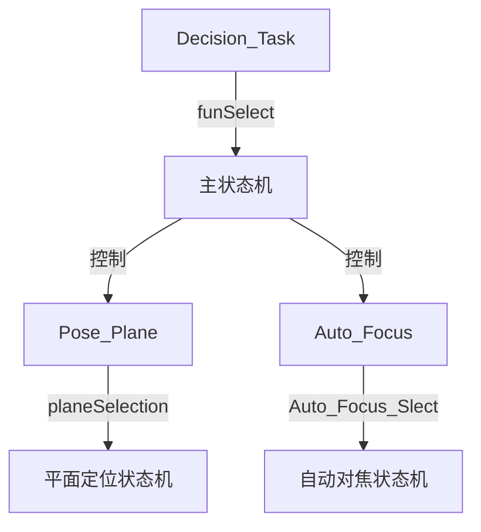
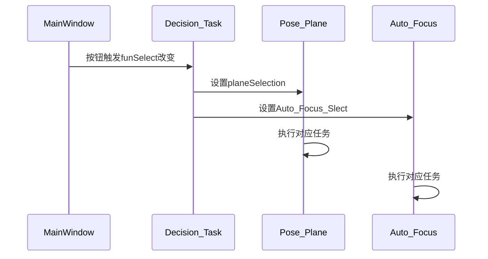
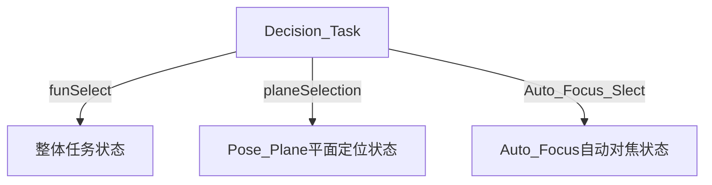
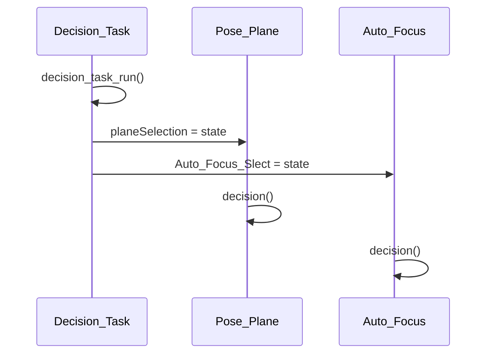
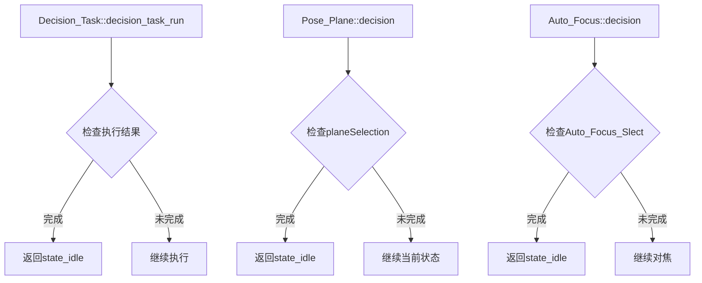
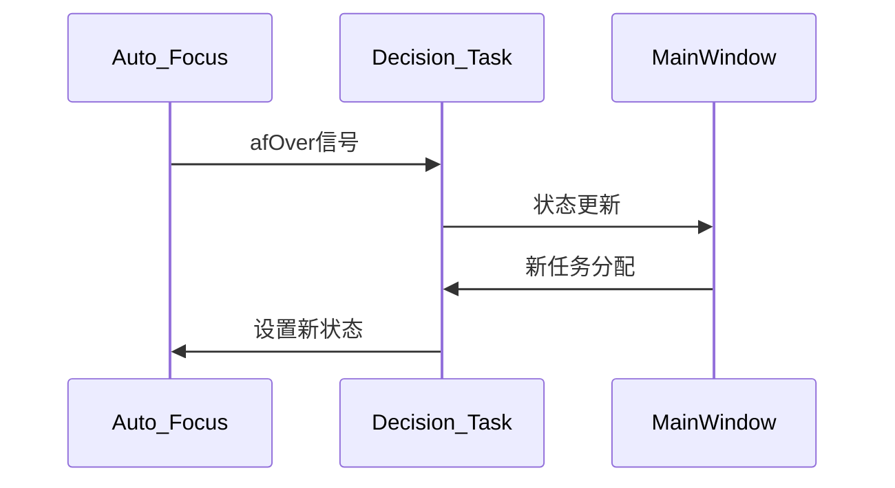

    state_idle=-1,
    state_init=100和funselect到底是什么关系？
还有position_tip的void Pose_Plane::decision()函数的工作流程 是什么?
，这个文件是根据planeselection来决定当前的状态的吗？这个Auto_Focus_Slect是由谁赋值中也有state_init;和state_ible,  
还有position_cell文件void Auto_Focus::decision()函数，这个函数的工作逻辑，流程是什么?
也是通过的Auto_Focus_Slect的值来决策这个文件的状态吗？
这个Auto_Focus_Slect是由谁赋值中也有state_init;和state_ible,
这几个不同文件的desicion函数是同一个stateinit和state_ible赋值吗？
这几个文件的关系是什么，如何联系起来的，我该怎样使用来完成什么任务

让我详细解释这些状态和决策系统：

# 1. 状态定义和关系



## 1.1 状态值定义
```cpp
// 通用状态值
#define state_idle -1    // 空闲状态
#define state_init 100   // 初始状态

// 特定功能状态值
enum tip_States {        // 平面定位状态
    state_coordinateTransformation = 2,
    state_touchDetection = 3,
    // ...
};

enum focus_States {      // 自动对焦状态
    state_coarseAdjust = 2,
    state_fineAdjust = 3,
    // ...
};
```

# 2. 决策函数工作流程

## 2.1 Decision_Task决策
```cpp
void Decision_Task::decision_task_run() {
    switch (funSelect) {
        case 100:  // 初始化定时器
            timer = new QTimer();
            timer->start();
            break;
            
        case 1:   // 全自动模式
            A_Focus->Auto_Focus_Slect = stateHandle[actionStep].x;
            pose_plane->planeSelection = stateHandle[actionStep].y;
            break;
            
        case 4:   // 半自动模式
            // ...其他模式
    }
}
```

## 2.2 Pose_Plane决策
```cpp
void Pose_Plane::decision() {
    switch (planeSelection) {
        case state_touchDetection:  // 接触检测
            touchDetection();
            break;
            
        case state_coordinateTransformation:  // 坐标转换
            coordinateTransformation();
            break;
    }
}
```

## 2.3 Auto_Focus决策
```cpp
void Auto_Focus::decision() {
    switch (Auto_Focus_Slect) {
        case state_coarseAdjust:  // 粗调焦
            coarseAdjust();
            break;
            
        case state_fineAdjust:   // 精调焦
            fineAdjust();
            break;
    }
}
```

# 3. 各模块联系



# 4. 使用示例

1. **初始化接触检测**:
```cpp
// 在MainWindow中
void MainWindow::on_NextAction_clicked() {
    decision_task->funSelect = 4;  // 设置半自动模式
}
```

2. **执行自动对焦**:
```cpp
// 在决策任务中
if (A_Focus->Auto_Focus_Slect < 0) {
    A_Focus->Auto_Focus_Slect = state_coarseAdjust;
}
```

3. **执行坐标转换**:
```cpp
// 在决策任务中
if (pose_plane->planeSelection < 0) {
    pose_plane->planeSelection = state_coordinateTransformation;
}
```

这套系统主要用于:
1. 自动对焦控制
2. 平面定位控制
3. 接触检测
4. 坐标转换
5. 运动控制
6. 
---------------------------------------------------------------
我来详细解释这些状态值和decision函数的关系：

# 1. 状态值定义位置

```cpp
// 通用基础状态(base_head.h)
#define state_idle -1    // 所有模块通用的空闲状态
#define state_init 100   // 所有模块通用的初始状态

// 平面定位状态(positioning_tip.h)
enum tip_States {
    state_nonOvershootPositioning = 1,
    state_coordinateTransformation = 2,
    state_touchDetection = 3,
    // ...其他平面定位相关状态
};

// 自动对焦状态(positioning_cell.h)
enum focus_States {
    state_coarseAdjust = 2,
    state_fineAdjust = 3,
    state_cellAutofocus = 4,
    // ...其他自动对焦相关状态
};
```

# 2. 状态值使用区分



# 3. 各模块decision函数关系



## 3.1 Decision_Task决策函数
```cpp
void Decision_Task::decision_task_run() {
    switch (funSelect) {
        case 1:  // 全自动模式
            A_Focus->Auto_Focus_Slect = stateHandle[actionStep].x;
            pose_plane->planeSelection = stateHandle[actionStep].y;
            break;
        case 4:  // 半自动模式
            // ...
    }
}
```

## 3.2 Pose_Plane决策函数
```cpp
void Pose_Plane::decision() {
    switch (planeSelection) {
        case state_touchDetection:  // 接触检测
            touchDetection();
            break;
        case state_tipFocusing:    // 针尖对焦
            tipFocusing();
            break;
    }
}
```

## 3.3 Auto_Focus决策函数
```cpp
void Auto_Focus::decision() {
    switch (Auto_Focus_Slect) {
        case state_coarseAdjust:   // 粗调焦
            coarseAdjust();
            break;
        case state_cellAutofocus:  // 细胞自动对焦
            cellAutofocus();
            break;
    }
}
```

# 4. 状态值使用示例

```cpp
// 在MainWindow中启动半自动模式
void MainWindow::on_startButton_clicked() {
    decision_task->funSelect = 4;  // 设置半自动模式
}

// Decision_Task分配任务
if(actionStep == 0) {
    A_Focus->Auto_Focus_Slect = state_coarseAdjust;  // 分配对焦任务
    pose_plane->planeSelection = state_tipFocusing;   // 分配定位任务
}

// 任务完成后返回空闲状态
A_Focus->Auto_Focus_Slect = state_idle;
pose_plane->planeSelection = state_idle;
```

这三个decision函数构成了层级控制结构：
1. Decision_Task控制整体流程
2. Pose_Plane负责平面定位具体执行
3. Auto_Focus负责自动对焦具体执行
----------------------------------------------------------------------------
让我分析各个decision函数完成后的状态转换流程：



# 1. Decision_Task::decision_task_run()
```cpp
void Decision_Task::decision_task_run() {
    // ...执行完成后
    if (任务完成) {
        funSelect = state_idle;  // 重置状态
        return;  // 等待下一次timer触发
    }
    // 继续执行当前任务
}
```

# 2. Pose_Plane::decision()
```cpp
void Pose_Plane::decision() {
    // ...执行完成后
    if (planeSelection == state_idle) {
        // 任务完成
        planeSelection = state_init;  // 重置状态
        return;  // 等待新任务
    }
    // 继续执行当前任务
}
```

# 3. Auto_Focus::decision()
```cpp
void Auto_Focus::decision() {
    // ...执行完成后
    if (Auto_Focus_Slect == state_idle) {
        // 对焦完成
        Auto_Focus_Slect = state_init;  // 重置状态
        emit afOver();  // 发送完成信号
        return;  // 等待新任务
    }
    // 继续对焦
}
```

# 4. 状态转换流程

1. **完成时**:
- 将状态设为 state_idle
- 发送完成信号
- 等待新任务分配

2. **未完成时**:
- 保持当前状态
- 继续执行任务
- 等待下一次定时器触发

# 5. 信号传递



所以任务完成后都会:
1. 重置状态
2. 发送完成信号
3. 等待新任务分配
4. 准备下一轮执行
