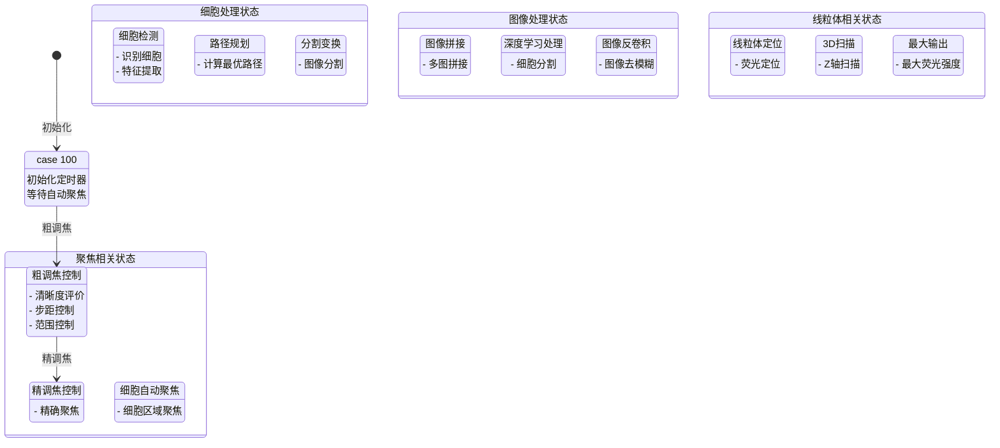
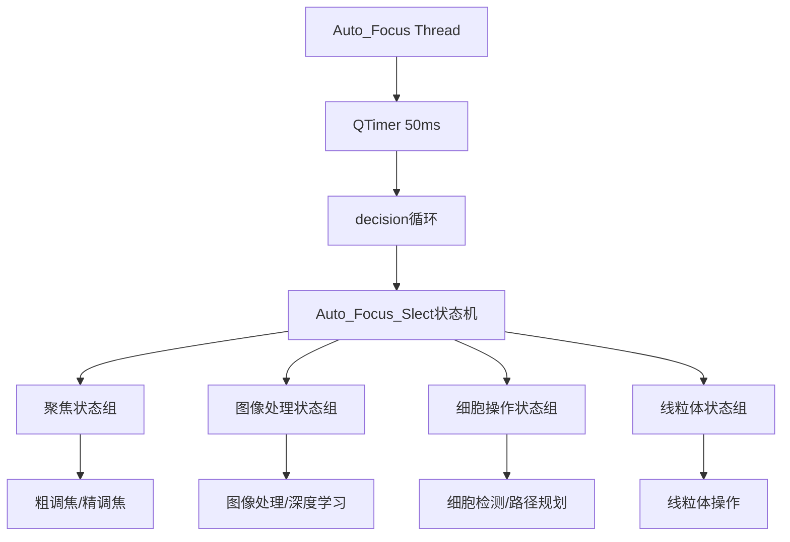
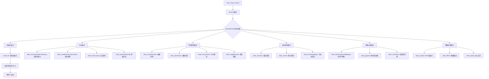
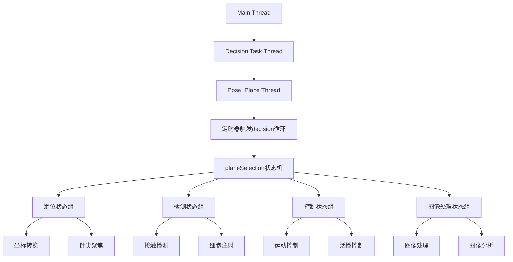
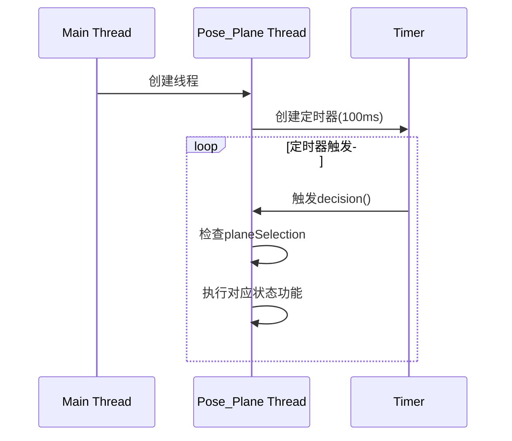

position——cell
让我详细分析Auto_Focus::decision()函数中的状态值和功能实现，以及与线程的关系：

1. 线程和状态机关系：
- Auto_Focus在独立线程中运行
- 通过50ms定时器触发decision()循环
- 使用Auto_Focus_Slect控制状态切换

2. 状态机流程图：



3. 主要功能组：

A. 初始化和聚焦功能：
```cpp
case 100: // 初始化
    - 设置定时器(50ms)
    - 启动循环执行

case state_coarseAdjust: // 粗调焦
    - 清晰度评价
    - 步距控制(5)
    - 范围控制(-150,500)
    
case state_fineAdjust: // 精调焦
    - 精确聚焦控制
    
case state_cellAutofocus: // 细胞自动聚焦
    - 细胞区域聚焦
```

B. 图像处理功能：
```cpp
case state_imageStitching: // 图像拼接
    - 多幅图像拼接

case state_deeplearning: // 深度学习
    - 细胞检测与分割
    
case state_deconvolution: // 反卷积
    - 图像去模糊处理
```

C. 细胞操作功能：
```cpp
case state_cellDetection: // 细胞检测
    - 识别细胞
    - 特征提取
    
case state_pathPlaning: // 路径规划
    - 计算最优路径
    
case state_segmentTransform: // 分割变换
    - 图像分割处理
```

D. 线粒体相关功能：
```cpp
case state_mitolocalization: // 线粒体定位
    - 荧光定位
    
case state_3Dscanning: // 3D扫描
    - Z轴扫描成像
    
case state_maximumout: // 最大输出
    - 寻找最大荧光强度
```

4. 线程与状态的关系：



这种设计实现了：
1. 状态间的有序切换
2. 功能模块的解耦
3. 实时响应能力
4. 异步处理能力

通过定时器触发的状态机机制，保证了各功能在独立线程中有序执行，同时保持了系统的响应性和可维护性。

------------------------------------------------------------------------------------

让我详细解析Pose_Plane::decision()函数中的状态值和功能实现，以及它们与线程的关系：

1. 状态机基本工作流程：



2. 线程和状态值关系：



3. 主要功能组说明：

A. 初始化功能组：
- state_init: 系统初始化
  - 设置控制对象
  - 初始化定时器
  - 启动运行循环

B. 定位功能组：
- state_nonOvershootPositioning: 无超调定位
- state_coordinateTransformation: 坐标转换
  - coordinateTransformation: 基本转换
  - coordinateTransformationclick: 基于点击
  - coordinateTransformationdeep: 基于深度学习
  - coordinateTransformationLsq: 基于最小二乘

C. 检测控制组：
- state_touchDetection: 接触检测
  - touchDetection: 基本检测
  - touchDetectionclick: 基于点击
  - touchDetectionmitochondria: 线粒体检测
  - touchDetectionmitochondriamoment: 基于质心

D. 运动控制组：
- state_moveOut/state_moveIn: 移出/移入控制
- state_semiAutoBiopsy: 半自动活检
- state_manualmove: 手动控制

E. 特殊功能组：
- state_electrochemicalMapping: 电化学映射
- state_gigaseal: 膜片钳封接
- state_verification: 线粒体控制

4. 状态机的线程特点：

- 在独立线程中运行
- 通过100ms定时器触发状态检查
- 状态转换通过修改planeSelection实现
- 各状态函数相互独立运行
- 可以处理异步事件和信号

5. 线程同步机制：



这种设计实现了：
1. 功能模块的解耦
2. 实时响应能力
3. 状态切换的灵活性
4. 异步处理的可靠性

----------------------------------------------------------------------------------------------------------------
让我详细解析Pose_Plane::decision()函数中的状态值和功能实现，以及它们与线程的关系：

1. 状态机基本工作流程：


2. 线程和状态值关系：


3. 主要功能组说明：

A. 初始化功能组：
- state_init: 系统初始化
  - 设置控制对象
  - 初始化定时器
  - 启动运行循环

B. 定位功能组：
- state_nonOvershootPositioning: 无超调定位
- state_coordinateTransformation: 坐标转换
  - coordinateTransformation: 基本转换
  - coordinateTransformationclick: 基于点击
  - coordinateTransformationdeep: 基于深度学习
  - coordinateTransformationLsq: 基于最小二乘

C. 检测控制组：
- state_touchDetection: 接触检测
  - touchDetection: 基本检测
  - touchDetectionclick: 基于点击
  - touchDetectionmitochondria: 线粒体检测
  - touchDetectionmitochondriamoment: 基于质心

D. 运动控制组：
- state_moveOut/state_moveIn: 移出/移入控制
- state_semiAutoBiopsy: 半自动活检
- state_manualmove: 手动控制

E. 特殊功能组：
- state_electrochemicalMapping: 电化学映射
- state_gigaseal: 膜片钳封接
- state_verification: 线粒体控制

4. 状态机的线程特点：

- 在独立线程中运行
- 通过100ms定时器触发状态检查
- 状态转换通过修改planeSelection实现
- 各状态函数相互独立运行
- 可以处理异步事件和信号

5. 线程同步机制：


这种设计实现了：
1. 功能模块的解耦
2. 实时响应能力
3. 状态切换的灵活性
4. 异步处理的可靠性


