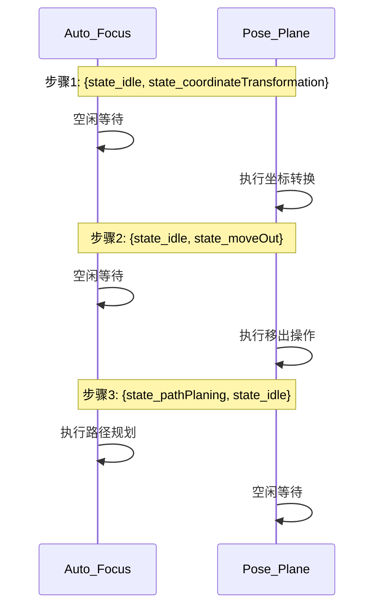
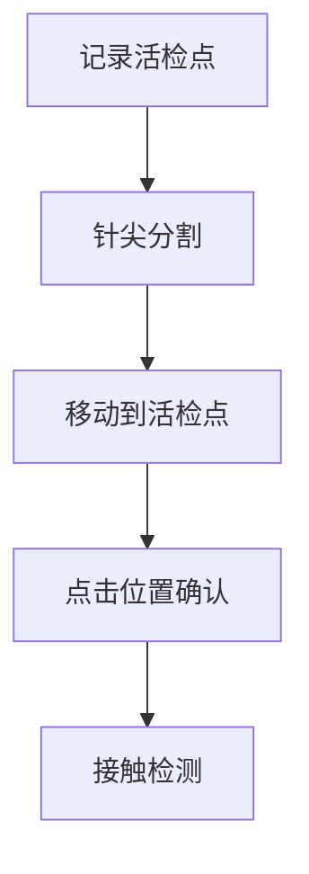
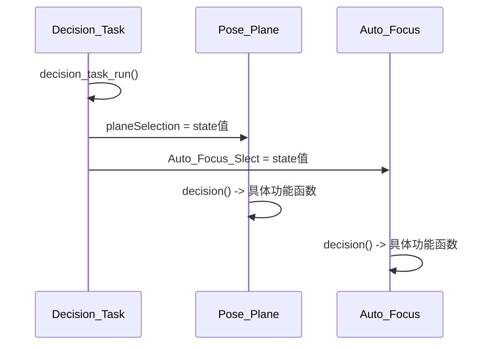

  vector<Point2i> stateHandle={{state_idle,state_coordinateTransformation},{state_idle,state_moveOut},
                                     {state_pathPlaning,state_idle},{state_idle,state_moveIn},
                                     {state_idle,state_manualmove},{state_idle,state_touchDetection},
                                     {state_idle,state_coordinateTransformation},
                                     {state_idle,state_penetration},{state_idle,state_electrochemicalMapping},{state_idle,state_idle}};//其中x是细胞的状态，y是针尖的状态
-----------------
让我来详细解释这个状态数组的结构：

# 1. 状态对的基本结构
```cpp
vector<Point2i> stateHandle = {
    {state_idle, state_coordinateTransformation},  // 第1步
    {state_idle, state_moveOut},                   // 第2步
    {state_pathPlaning, state_idle},              // 第3步
    // ...
};
```

每一对`{x, y}`代表：
- x: 自动对焦模块(`Auto_Focus`)的状态
- y: 平面定位模块(`Pose_Plane`)的状态

# 2. 状态流程示意图



# 3. 具体例子解析

以第一步为例：
```cpp
{state_idle, state_coordinateTransformation}
```
表示：
- `Auto_Focus`模块保持空闲(`state_idle = -1`)
- `Pose_Plane`模块执行坐标转换任务

在`decision_task_run()`中的使用：
```cpp
void Decision_Task::decision_task_run() {
    // 当前执行第actionStep步
    if(actionStep == 0) {
        // 设置各模块状态
        A_Focus->Auto_Focus_Slect = stateHandle[actionStep].x;  // state_idle
        pose_plane->planeSelection = stateHandle[actionStep].y; // state_coordinateTransformation
    }
}
```

这就是一个任务序列表，规定了不同时刻两个模块应该执行什么任务。
--------------
让我详细解释 Decision_Task.h 中的状态向量：

# 1. 主要状态向量分类

## 1.1 基础操作序列 (stateHandle)
```cpp
vector<Point2i> stateHandle = {
    {state_idle, state_coordinateTransformation},  // 步骤1：坐标转换 -> positioning_tip.cpp::coordinateTransformation()
    {state_idle, state_moveOut},                   // 步骤2：移出操作 -> positioning_tip.cpp::moveOut()
    {state_pathPlaning, state_idle},              // 步骤3：路径规划 -> positioning_cell.cpp::pathPlaning()
    // ...
};
```

## 1.2 半自动操作序列 (stateHandleSemi)


```cpp
vector<Point2i> stateHandleSemi = {
    {state_idle, state_biopsypointrecord},  // 记录活检点位置
    {state_idle, state_tipseg},             // 针尖分割
    {state_idle, state_movebiopsypoint},    // 移动到活检点
    // ...
};
```

## 1.3 全自动操作序列 (stateHandleAll)
```cpp
vector<Point2i> stateHandleAll = {
    {state_idle, state_biopsypointrecord},  // 记录活检点 -> positioning_tip.cpp::recordbiopsypoint()
    {state_idle, state_initplane},          // 初始化平面 -> positioning_tip.cpp::initplane()
    {state_idle, state_lensup},             // 镜头上移 -> positioning_tip.cpp::lensup()
    // ...
};
```

## 1.4 多次活检序列 (stateHandleMultibiopsy)
```cpp
vector<Point2i> stateHandleMultibiopsy = {
    {state_idle, state_movebiopsypoint},    // 移动到活检点
    {state_imagesemly, state_idle},         // 图像拼接
    {state_maximumout, state_idle},         // 最大输出
    // ...
};
```

# 2. 状态执行过程

以第一个状态向量为例：
```cpp
// 状态定义
{state_idle, state_coordinateTransformation}

// 在decision_task_run中的执行
void Decision_Task::decision_task_run() {
    // 设置状态
    A_Focus->Auto_Focus_Slect = stateHandle[actionStep].x;  // state_idle
    pose_plane->planeSelection = stateHandle[actionStep].y; // state_coordinateTransformation
    
    // Pose_Plane模块执行对应函数
    // positioning_tip.cpp中的coordinateTransformation()被调用
}
```

# 3. 函数调用关系

